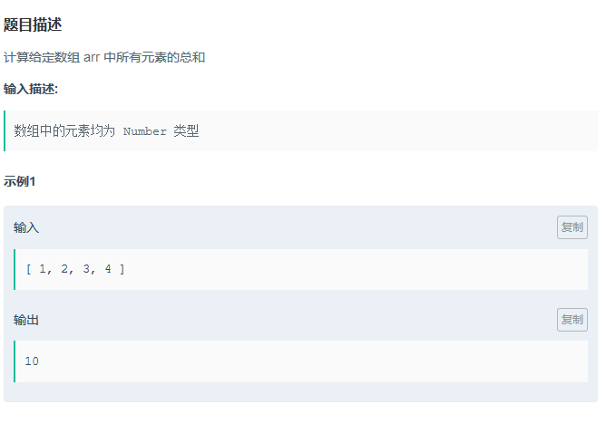
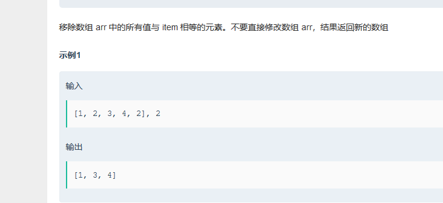

#  JavaScript面试题

## 数组

### 1.查找数组位置

 

```javascript
function indexOf(arr, item) {
  if (Array.prototype.indexOf){
      return arr.indexOf(item);
  } else {
      for (var i = 0; i < arr.length; i++){
          if (arr[i] === item){
              return i;
          }
      }
  }     
  return -1;
} 
```


**难点**：代码中 if (Array.prototype.indexOf) 判断是否支持indexOf方法，ECMAScript提供了两种方法indexof(),lastindexof(),表示要查找的项和起点位置的索引。

**注**：indexOf方法的使用（这里有点疑问就是为什么不用算法会不对）！！！

### 2.数组求和



```javascript
不考虑算法复杂度，用递归做：

function sum(arr) {
    var len = arr.length;
    if(len == 0){
        return 0;
    } else if (len == 1){
        return arr[0];
    } else {
        return arr[0] + sum(arr.slice(1));
    }
}

常规循环：	

function sum(arr) {
    var s = 0;
    for (var i=arr.length-1; i>=0; i--) {
        s += arr[i];
    }
    return s;
}

函数式编程 map-reduce：	

function sum(arr) {
    return arr.reduce(function(prev, curr, idx, arr){
        return prev + curr;
    });
}

forEach遍历：

function sum(arr) {
    var s = 0;
    arr.forEach(function(val, idx, arr) {
        s += val;
    }, 0);
  
    return s;
};

eval：

function sum(arr) {
    return eval(arr.join("+"));
};
```

 

**难点**：小白算法一个，只会常规循环！！！

递归算法不考虑时间复杂度：slice() 方法：可从已有的数组中返回选定的元素，语法为：arrayObject.slice(start,end)，返回一个新数组，不修改原数组。

函数式编程 map-reduce：一丁点看不懂逼格很高的reduce函数，其实和for,foreach,差不多

eval：eval() 函数可计算某个字符串，join() 方法将一个数组（或一个类数组对象）的所有元素连接成一个字符串并返回这个字符串，合起来就是了。

### 3.移除数组中的元素

### 


```javascript
1.splice()

function remove(arr,item){
    var newarr = arr.slice(0);
    for(var i=0;i<newarr.length;i++){
        if(newarr[i] == item){
            newarr.splice(i,1);
            i--;
        }
    }
    return newarr;
}				

2.push()

function remove(arr,item){
    var newarr = [];
    for(var i=0;i<arr.length;i++){
        if(arr[i] != item){
            newarr.push(arr[i]);
        }
    }
    return newarr;
}  
//差别就是判断
function remove(arr,item){
    var newarr = [];
    for(var i=0;i<arr.length;i++){
        if(arr[i] == item)continue;
       newarr.push(arr[i]);
    }
    return nawarr;
} 

3.Array.prototype.filter()

function remove(arr,item){
    return arr.filter(function(ele){
         return ele != item;
    })
}
```

**难点**：Array.prototype.filter()：filter() 方法创建一个新的数组，新数组中的元素是通过检查指定数组中符合条件的所有元素。

**注**：splice()方法向/从数组中添加/删除项目，会改变原来数组，所以要var newarr = arr.slice(0);，使用slice新拷贝一个数组再操作。

### 4.添加数组元素


```javascript
/**
 * 普通的迭代拷贝
 */
var append = function(arr, item) {
    var length = arr.length,
        newArr = [];
 
    for (var i = 0; i < length; i++) {
        newArr.push(arr[i]);
    }
 
    newArr.push(item);
 
    return newArr;
};
 
/*
 * 使用slice浅拷贝+push组合
 */
var append2 = function(arr, item) {
    var newArr = arr.slice(0);  // slice(start, end)浅拷贝数组
    newArr.push(item);
    return newArr;
};
 
/*
 * 使用concat将传入的数组或非数组值与原数组合并,组成一个新的数组并返回
 */
var append3 = function(arr, item) {
    return arr.concat(item);
};
```


**难点**：concat() 方法用于连接两个或多个数组。

###　5.删除数组最后一个元素


```javascript

//利用slice
function truncate(arr) {
    return arr.slice(0,-1);
}
//利用filter
function truncate(arr) {
    return arr.filter(function(v,i,ar) {
        return i!==ar.length-1;
    });
}
//利用push.apply+pop
function truncate(arr) {
    var newArr=[];
    [].push.apply(newArr, arr);
    newArr.pop();
    return newArr;
}
//利用join+split+pop    注意！！！：数据类型会变成字符型
function truncate(arr) {
    var newArr = arr.join().split(',');
    newArr.pop();
    return newArr;
}
//利用concat+pop
function truncate(arr) {
    var newArr = arr.concat();
    newArr.pop();
    return newArr;
}
//普通的迭代拷贝
function truncate(arr, item) {
    var newArr=[];
    for(var i=0;i<arr.length-1;i++){
        newArr.push(arr[i]);
    }
    return newArr;
}

```

**注**：一般都是拷贝之后删除

### 6.数组合并


```javascript
//利用concat
function concat(arr1, arr2) {
    return arr1.concat(arr2);
}
//利用slice+push.apply
function concat(arr1, arr2) {
    var newArr=arr1.slice(0);
    [].push.apply(newArr, arr2);
    return newArr;
}
//利用slice+push
function concat(arr1, arr2) {
    var newArr=arr1.slice(0);
    for(var i=0;i<arr2.length;i++){
        newArr.push(arr2[i]);
    }
    return newArr;
}
//普通的迭代拷贝
function concat(arr1, arr2) {
    var newArr=[];
    for(var i=0;i<arr1.length;i++){
        newArr.push(arr1[i]);
    }
    for(var j=0;j<arr2.length;j++){
        newArr.push(arr2[j]);
    }
    return newArr;
}
```

### 7.计算数组中元素出现个数


```javascript
//filter()-->利用指定的函数确定是否在返回的数组中包含某一项
        function count(arr, item) {
            var count = arr.filter(function(a) {
                return a === item;   //返回true的项组成的数组
            });
            return count.length;
        }
        //map()-->对数组中的每一项进行给定函数，
        //返回每次函数条用的结果组成的数组；
        function count(arr, item) {
            var count = 0;
            arr.map(function(a) {
                if(a === item) {
                    count++;
                }
            });
            return count;
        }
        //for循环
        function count(arr, item) {
            var count = 0;
            for(var i=0; i<arr.length; i++) {
                if(arr[i] === item) {
                    count++;
                }
            }
            return count;
        }
        //reduce()-->从数组的第一项开始，逐个遍历到最后；
        function count(arr, item) {
            var count = arr.reduce(function(prev, curr) {
                return curr === item ? prev+1 : prev;
            }, 0);
            return count;
        }
                //forEach()-->对数组中的每一项运行传入的函数
        function count(arr, item) {
            var count = 0;
            arr.forEach(function(a) {
                a === item ? count++ : 0;
            });
            return count;
        }
```

**注**：`[].map();` 基本用法跟`forEach`方法类似

### 8.查找重复元素


```javascript
function duplicates(arr) {
 var result = [];
    arr.forEach(function(elem){
       if(arr.indexOf(elem) !=arr.lastIndexOf(elem) && result.indexOf(elem) == -1){
           result.push(elem);
       }
    });
    return result;
}
```

**注**：只会这一种，呵呵看到好多不过感觉自己的挺好用！！！

### 9.求二次方


```javascript

function square(arr) {
    return arr.map(function(item,index,array){
        return item*item;
    })
}


//常规
function square(arr) {
    var newArr = [];
    for(var i=0;i<arr.length;i++){
        newArr.push(arr[i]*arr[i]);
    }
    return newArr;
}
```


## 编程规范  

### 1.修复函数定义


```javascript

function functions(flag) {
   var getvalue=null;
    if (flag) {
      getValue = function(){ return 'a'; }
    } else {
      getValue = function() { return 'b'; }
    }

    return getValue();
}

```

**注**：这道题是考函数声明与函数表达式的区别，原题的写法，是在两个逻辑分支里面各有一个函数声明，但是对于函数声明，解析器会率先读取并且让其在执行任何代码前可用，意思就是别的代码还没运行呢，两个getValue声明已经被读取，所以总是执行最新的那个。函数表达式，当解析器执行到它所在的代码行时，才会真正被解释执行，所以两个逻辑分支可以分别执行 。

