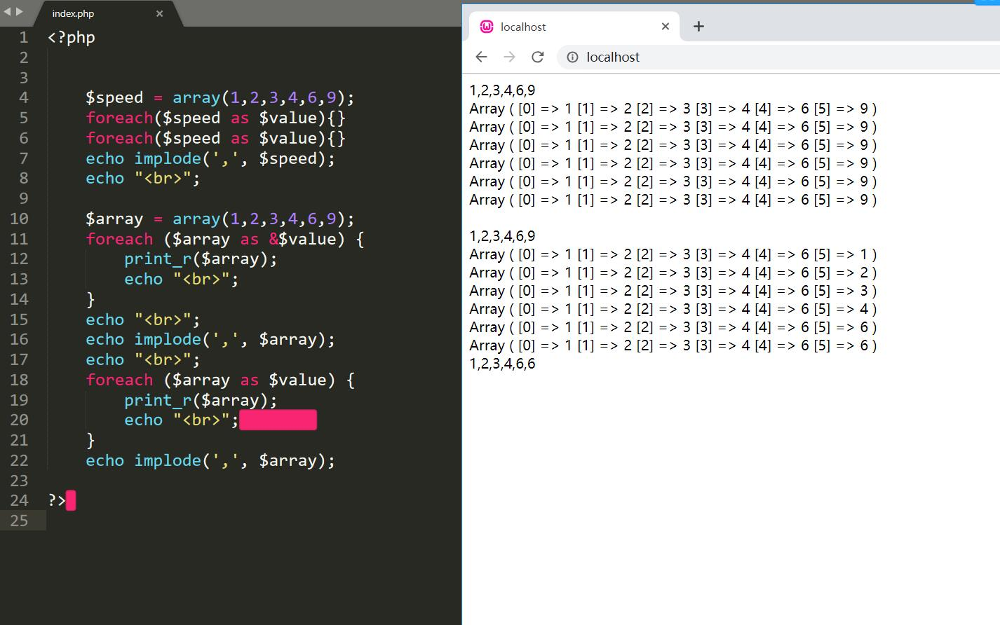

# PHP面试编程题

**写一个函数尽可能高效地从一个标准 url 里取出文件的扩展名。例如，http://www.sina.com.cn/abc/de/fg.php?id=1 需要取出 php 或 .php**

```php
解法1：
function getTzName($url)
{
	$url = parse_url($url);
	$url=explode('.',$url['path']);
	return $url[1];
}
$url = "https://weibo.com/ttarticle/p/show.php?id=26";
print_r(getTzName($url));
//注：pase_url()
parse_url() 该函数解析url、返回其组成部分；
　　返回关联数组
　　scheme 　　 方案；如 http
　　host 　　　　域名
　　port
　　user 　　　　用户
　　pass
　　path 　　　　路径
　　query 　　　 在问号？之后
　　fragment 　   在散列符号#之后

例：
Array(
　　[scheme] = >http
　　[host] => www.abc.com
　　[path] => /ab/cd/e.php
　　[query] => id=1&data=2
　　[fragment] => laowen
)

 解法2：
    
function getExt($url){
	$arr = parse_url($url);
	$file = basename($arr['path']);
	$ext = explode(".",$file);
	return $ext[1];
}
$url = "https://weibo.com/ttarticle/p/show.php?id=26";
print_r(getExt($url));

//注：basename() 函数返回路径中的文件名部分。

```


**单例模式是在应用程序中最多只能拥有一个该类的实例存在，一旦创建就会一直在内存中。**

用·php创建一个单例模式的数据库类

```php
由于单例模式的设定，所以常应用于数据库类设计，它可以保证只连接一次数据库。
单例类的特点如下：
1）单例类不能直接实例化创建，只能由类本身实例化。因此，构造函数必须标记为private，从而防止类被实例化。
2）需要保证一个能访问到的实例公开的静态方法和一个私有静态成员变量来保存类实例。
3）类中通常需要有一个空的私有__clone()方法防止别人对单例类进行实例克隆。
示例代码如下：
<?php  
	class Database  
	{   
		private static $instance;
		private function __construct()  
		{  
			// to do 
		}  
		private function __clone()   
		{  
			// to do  
		}  
		public static function getInstance()   
		{  
			if (!(self::$instance instanceof self)) {  
				self::$instance = new self();  
		}  
			return self::$instance;  
		}  
	}  
	$a =Database::getInstance();  
	$b =Database::getInstance();  
	print_r($a === $b);  
?>
```

**php中foreach指针注意事项**

```php
$arr = [1,2,3];
foreach ($arr as &$value){}
foreach ($arr as $value){};
 
echo $key;
echo $value;
 
echo "<pre>";
print_r($arr);exit;//1,2,2
```




在执行第一个使用引用的 foreach 时， 一开始， $value 指向 $array[0] 的存储空间(地址)，空间内存储着 1 ， 一直到foreach 结束时， $value 指向 $array[5] (最后的地址)的存储空间，空间内存储着 9 。

 下面要开始执行第二个 foreach 了，注意和第一个 foreach 不同， 第二个 foreach 没有使用引用，那么就是赋值方式， 即将 $array 的值依次 赋值 给 $value。 进行到第一个元素时，要将 $array[0] 赋值给 $value 。 问题就在这里，由于刚刚执行完第一个 foreach， **$v 不是一个新变量，而是已经存在的、指向 $array[5] (最后的地址)的存储空间**， 如此一来，对 $value进行赋值的时候，**就将 $array[0] = 1 写入了 $array[5] 的实际存储空间**，(如上图第一次循环key值5的变量为1)相当于对 $array[5] 进行赋值。**而此时的$array数组也变成[1,2,3,4,6,1]**依此类推，第二个 foreach 执行到第5次时，数组则为[1,2,3,4,6,6]在第六次对$array[5] 的实际存储空间进行重写时，此时从上一次数组[1,2,3,4,6,6]找到的$array[5] 中的值是6（已经被上一次的$array[4]重写成6），所以找到的$array[5] 的存储空间的值是6，所以数组遍历到最后就是[1,2,3,4,6,6]。

