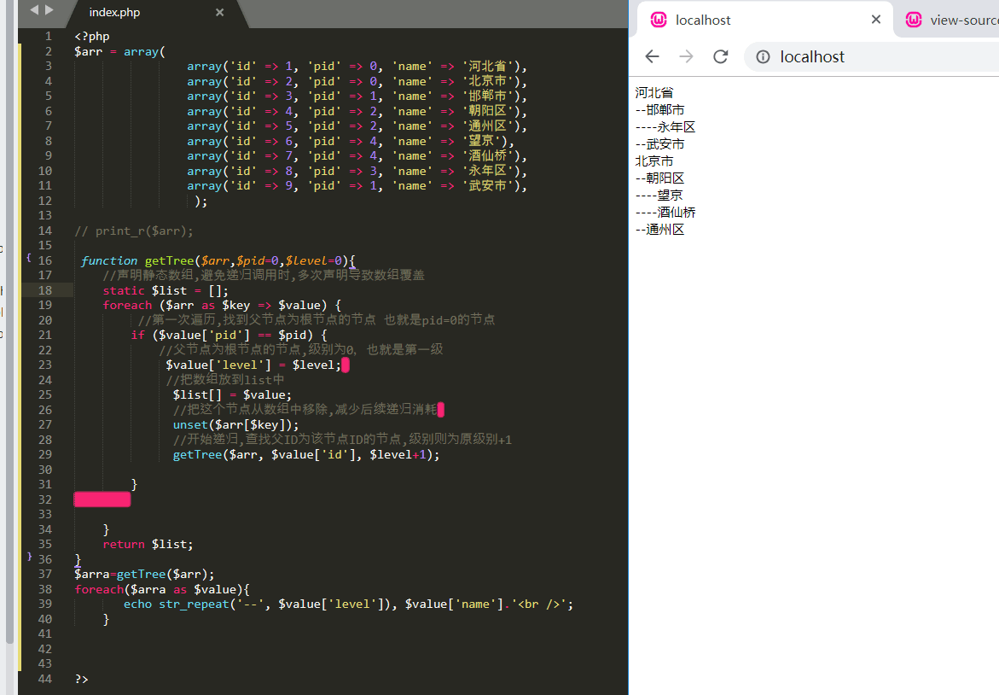
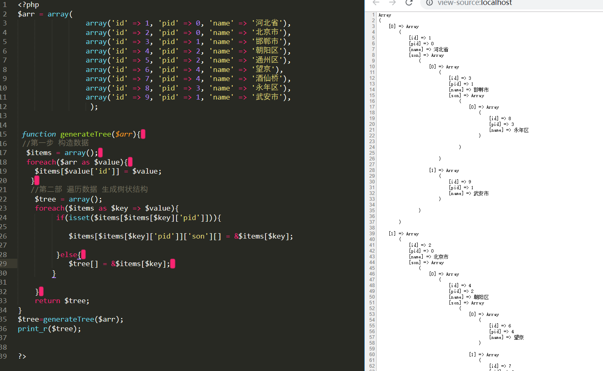

### echo print print_r区别

####  1.各自的定义

**echo**
可以一次输出多个值，多个值之间用逗号分隔。echo是语言结构(language construct)，而并不是真正的函数，因此不能作为表达式的一部分使用。

**print()**
函数print()打印一个值（它的参数），如果字符串成功显示则返回true，否则返回false。

**print_r()**
可以把字符串和数字简单地打印出来，而数组则以括起来的键和值得列表形式显示，并以Array开头。但print_r()输出布尔值和NULL的结果没有意义，因为都是打印"\n"。因此用var_dump()函数更适合调试。

**var_dump()**
判断一个变量的类型与长度,并输出变量的数值,如果变量有值输的是变量的值并回返数据类型。此函数显示关于一个或多个表达式的结构信息，包括表达式的类型与值。数组将递归展开值，通过缩进显示其结构。

#### 2.echo 和 print 的区别

共同点：首先echo 和 print 都不是严格意义上的函数，他们都是 语言结构;他们都只能输出 字符串，整型跟int型浮点型数据。不能打印复合型和资源型数据；

而区别是：echo 可以连续输出多个变量，而print只能一次输出一个变量。print打印的值能直接复制给一个变量，如 $a = print “123”;

而echo 不可以，它没有像函数的行为，所以不能用于函数的上下文。在使用时，echo() 函数比 [print()](http://www.w3school.com.cn/php/func_string_print.asp)速度稍快。 

#### 3.var_dump()和print_r()的区别

共同点：两者都可以打印数组，对象之类的复合型变量。

区别：print_r() 只能打印一些易于理解的信息，且print_r()在打印数组时，会将把数组的指针移到最后边，使用 reset()  可让指针回到开始处。  而var_dump()不但能打印复合类型的数据，还能打印资源类型的变量。且var_dump()输出的信息则比较详细，一般调试时用得多。


### Linux和window换行符的区别

回车”（Carriage Return）和“换行”（Line Feed）这两个概念的来历和区别。
**符号        ASCII码        意义 **

\n               10              换行

 \r               13             回车CR

 在计算机还没有出现之前，有一种叫做电传打字机（Teletype Model  33，Linux/Unix下的tty概念也来自于此）的玩意，每秒钟可以打10个字符。但是它有一个问题，就是打完一行换行的时候，要用去0.2秒，正好可以打两个字符。要是在这0.2秒里面，又有新的字符传过来，那么这个字符将丢失。
 于是，研制人员想了个办法解决这个问题，就是在每行后面加两个表示结束的字符。一个叫做“回车”，告诉打字机把打印头定位在左边界；另一个叫做“换行”，告诉打字机把纸向下移一行。这就是“换行”和“回车”的来历，从它们的英语名字上也可以看出一二。
 后来，计算机发明了，这两个概念也就被般到了计算机上。那时，存储器很贵，一些科学家认为在每行结尾加两个字符太浪费了，加一个就可以。于是，就出现了分歧。

 在Windows中：
 '\r' 回车，回到当前行的行首，而不会换到下一行，如果接着输出的话，本行以前的内容会被逐一覆盖；
 '\n' 换行，换到当前位置的下一行，而不会回到行首；

 Unix系统里，每行结尾只有**“<换行>”，即"\n"**；Windows系统里面，每行结尾是“**<回车><换行>”，即“\r\n”**；Mac系统里，每行结尾是**“<回车>”，即"\r"**；。一个直接后果是，Unix/Mac系统下的文件在Windows里打开的话，所有文字会变成一行；而Windows里的文件在Unix/Mac下打开的话，在每行的结尾可能会多出一个^M符号。

分别在Windws和Linux中查看此文件可知:
 Linux中遇到换行符("\n")会进行回车+换行的操作，回车符反而只会作为控制字符("^M")显示，不发生回车的操作。而windows中要回车符+换行符("\r\n")才会回车+换行，缺少一个控制符或者顺序不对都不能正确的另起一行。

c语言编程时（windows系统）\r 就是return 回到 本行 行首 这就会把这一行以前的输出 覆盖掉
 如：
 int main() {
 cout << "hahaha" << "\r" << "xixi" ;
 }
 最后只显示 xixi 而 hahaha 被覆盖了
 \n 是回车＋换行 把光标 先移到 行首 然后换到下一行 也就是 下一行的行首拉
 int main() {
 cout << "hahaha" << "\n" << "xixi" ;
 }
 则 显示
 hahaha
 xixi

 在windows   系统中,当你输入回车时会自动变成\r\n

 在linux下的回车键只代表\n

 而在windows下的回车键表示\r\n

 \n为进入下一行,\r为打印头回到行首上

**linux/unix下只用\n,它就表示回车+换行而windows下,\r只回车不换行的,\n是换行,但在有些编辑中,单独的\n是不会换行的(如notepad)  **

 一般在程序中,写\n就可以了,它在linux或windows中都能实现回车+换行的功能(只是在文本文件中,linux只会有0x0a,windows会自动换为0x0d   0x0a)


### 静态方法和非静态方法的区别

```
静态方法和非静态方法的区别总结如下：
1、静态方法属于类所有，类实例化前即可使用； 
2、非静态方法可以访问类中的任何成员，静态方法只能访问类中的静态成员； 
3、因为静态方法在类实例化前就可以使用，而类中的非静态变量必须在实例化之后才能分配内存；    
4、static内部只能出现static变量和其他static方法!而且static方法中还不能使用this等关键字，因为它是属于整个类；
5、静态方法效率上要比实例化高，静态方法的缺点是不自动进行销毁，而实例化的则可以做销毁； 
6、静态方法和静态变量创建后始终使用同一块内存，而使用实例的方式会创建多个内存。
主要区别：静态方法在创建对象前就可以使用了，非静态方法必须通过new出来的对象调用。
```

### 谈谈SQL注入的理解和防御措施有哪些

- 造成SQL注入的原因

SQL注入是通过在SQL语句被数据库解析之前，以修改其语法的形式工作的。只要你在解析语句之前插入动态部分，就存在SQL注入的风险。

动态部分：1、 用户传递进来的参数 2、 有可能是从数据库查询出来的

#### 防止SQL注入的一些方法

1. 转义

   防止SQL语句包含任何不匹配的引号的最古老的方法，就是对所有的引号字符进行转义操作，使他们不至于成为字符串的结束符。

   比如PDO的quote()函数

2. 查询参数

   查询参数的做法是在准备查询语句的时候，在对应参数的地方使用参数占位符。随后，在执行这个预先准备好的查询时提供一个参数。

   $stmt = $pdo->prepare('select id,name from user where name = ?');

   $params = array($_POST['name']);

   $stmt->execute($params);

   - 查询参数的不足：

```
   \1. 多个值的列表不可以当成单一参数

        $stmt = $pdo->prepare('select * from user where id in (?)');

       $stmt->execute(array('1,2,3'));

        上面的查询结果和下面的不一样：

        select * from user where id in(1,2,3)

   \2. 表名无法作为参数

        $stmt = $pdo->prepare('select id,name from ? where id =12');

       $stmt->execute(array('user'));

       这么做是想将一个字符串插入表名所在位置，但是这是报错的

   \3. 列名无法作为参数

       //这是错误的
        $stmt = $pdo->prepare('select ? from ?user where id =12');

   \4. SQL关键字不能作为参数

       //这是错误的
       $stmt = $pdo->prepare('select id,name from user order by id ?');

       $stmt->execute(array('desc'));
```


1. 就算是使用预处理插入数据的，也需要转义

   因为当你仅仅只是使用预处理执行插入语句，敏感字符是不会被转义的。后果是：在后续的查询中动态地使用未转义的数据也是有风险的。

   ```
    $sql = 'select * from user where id = 3';
     
     $row = $pdo->query($sql)->fetch(2);
     
     //当$row['name']值为 o'jack就会导致执行错误。
     //当$row['name']值为 ' or 1=1;#  就会将表的所有数据查询出来
    $sql = "select * from user where name = "."'{$row['name']}'";
    
    $stmtObj = $pdo->query($sql);
   
   对策： 所以不管是不是用户传递过来的参数，最好也使用预处理的方式来执行查询语句
   
   
   ```

   2. 检查输入的数据是否具有所期望的数据格式

```
 $sql = 'select id,name from user where id > ?';
  
 //这个时候，保证传递进来的一定是一个数字
 $stmt = $pdo->prepare($sql);
 $params = array(
    intval($_GET['id'])
);
 $stmt->execute($params);
```

#### 预处理原理

1. 数据库首先会解析准备好的SQL查询语句，在完成这一步操作之后，就没有任何方法能够改变那句SQL查询语句的结构。
2. 在执行一个已经准备好的SQL查询语句时，需要提供对应的参数，每个你提供的参数都对应预先准备好的查询语句中的一个占位符
3. 重复执行这个预先准备好的查询语句，只需要使用新的参数替换老的参数就行。

#### 将用户与代码隔离

> 预处理(查询参数)和转义字符能够帮助你将字符串类型的值插入到SQL中，但这些技术在需要插入表/列名或者SQL关键字的时候不起作用。

问题：

```
 $sortOrder = $_GET['sort'];//用户传递过来的
  
 //直接将用户传递过来的数据，拼接成SQl语句，不安全。
 $sql = "select id,name from user order by $sortOrder";
```

解决：

```
 将请求的参数作为索引值去查找预先定义好的值，然后用这些预先定义的值来组织SQL查询语句。
 
 $sortCondition = array(
    'up' => 'ASC',
    'down' => 'DESC'
 );
  
  
 //当需要倒序，用户传递down
 $sortOrder = $_GET['sort'];//用户传递过来的数据
  
 if (array_key_exists($sortOrder, $sortCondition) ) {
  
    $sort = $sortCondition[$sortOrder];
} else {
   $sort = 'DESC';
 }
 
 //现在$sort这变量就是安全的了，因为他只能是$sortCondition预先定义的值
 $sql = "select id,name from user order by $sort";
```

#### 审查代码

找到瑕疵的最好方法就是找一双眼睛一起来看看。

在检查代码是否包含SQL注入风险的时候，参考下面几点建议：

1. 找出所有使用了程序变量、字符串连接或者替换等方法组成的SQL语句
2. 跟踪在SQL语句中使用的动态内容来源。找出所有外部的输入，比如用户输入、文件、系统环境、网络服务、第三方代码、，甚至从数据库中获取的字符串
3. 假设任何外部内容都是潜在的威胁。对于不受信任的内容都要进行过滤，验证或者使用数组映射的方式来处理(参考“将用户与代码隔离”)
4. 在将外部数据合并到SQL语句时，使用查询参数，或者用稳健的转义函数预先处理
5. 别忘了在存储过程的代码以及任何其他使用SQL动态查询语句的地方做同样的检查

### 对于大流量的网站，采用什么方法解决访问量问题

**1、硬件方面 **
普通的一个p4的服务器每天最多能支持大约10万左右的IP，主要影响服务器的速度有：网络-硬盘读写速度-内存大小-cpu处理速度。

**2、软件方面**
静态页面
前台实现完全的静态化当然最好，可以完全不用访问数据库

数据库优化
表字段优化
语句优化
索引优化
分库分表
读写分离

**3、禁止外部的盗链**
外部盗链往往会加大服务器的请求和流量的负载压力，因此应该严格限制外部对于自身的图片或者文件盗链，
好在目前可以简单地通过refer来控制盗链，
Apache自己就可以通过配置来禁止盗链
IIS也有一些第三方的ISAPI可以实现同样的功能。
或者使用非技术手段来解决，比如在图片上增加水印

**4、控制大文件的下载。**
大文件的下载会占用很大的流量，并且对于非SCSI硬盘来说，大量文件下载会消耗
CPU，使得网站响应能力下降。因此，尽量不要提供超过2M的大文件下载，如果需要
提供，建议将大文件放在另外一台服务器上

**5、使用不同主机分流主要流量**
将文件放在不同的主机上，提供不同的镜像供用户下载。比如如果觉得RSS文件占用
流量大，那么使用FeedBurner或者FeedSky等服务将RSS输出放在其他主机上，这
样别人访问的流量压力就大多集中在FeedBurner的主机上，RSS就不占用太多资源了

**6、使用流量分析统计软件。**

在网站上安装一个流量分析统计软件，可以即时知道哪些地方耗费了大量流量，哪些页面需要再进行优化，因此，解决流量问题还需要进行精确的统计分析才可以。比如：Google Analytics（Google分析）。


### 无限极分类

解法1：**递归算法**

```php
 /**
     * 递归实现无限极分类
     * @param $array 分类数据
     * @param $pid 父ID
     * @param $level 分类级别
     * @return $list 分好类的数组 直接遍历即可 $level可以用来遍历缩进
     */
$arr = array(
				array('id' => 1, 'pid' => 0, 'name' => '河北省'),
				array('id' => 2, 'pid' => 0, 'name' => '北京市'),
				array('id' => 3, 'pid' => 1, 'name' => '邯郸市'),
				array('id' => 4, 'pid' => 2, 'name' => '朝阳区'),
				array('id' => 5, 'pid' => 2, 'name' => '通州区'),
				array('id' => 6, 'pid' => 4, 'name' => '望京'),
				array('id' => 7, 'pid' => 4, 'name' => '酒仙桥'),
				array('id' => 8, 'pid' => 3, 'name' => '永年区'),
				array('id' => 9, 'pid' => 1, 'name' => '武安市'),
				 );

// print_r($arr);

 function getTree($arr,$pid=0,$level=0){
	//声明静态数组,避免递归调用时,多次声明导致数组覆盖
	static $list = [];
	foreach ($arr as $key => $value) {
		 //第一次遍历,找到父节点为根节点的节点 也就是pid=0的节点
		if ($value['pid'] == $pid) {
			//父节点为根节点的节点,级别为0，也就是第一级
			 $value['level'] = $level; 
			 //把数组放到list中
			  $list[] = $value;
			  //把这个节点从数组中移除,减少后续递归消耗 
			  unset($arr[$key]);
			  //开始递归,查找父ID为该节点ID的节点,级别则为原级别+1
		 	  getTree($arr, $value['id'], $level+1);

		}
		

	}
	return $list;
}
$arra=getTree($arr);
foreach($arra as $value){
       echo str_repeat('--', $value['level']), $value['name'].'<br />';
    }
```



解法2：**引用算法**

```php
$arr = array(
				array('id' => 1, 'pid' => 0, 'name' => '河北省'),
				array('id' => 2, 'pid' => 0, 'name' => '北京市'),
				array('id' => 3, 'pid' => 1, 'name' => '邯郸市'),
				array('id' => 4, 'pid' => 2, 'name' => '朝阳区'),
				array('id' => 5, 'pid' => 2, 'name' => '通州区'),
				array('id' => 6, 'pid' => 4, 'name' => '望京'),
				array('id' => 7, 'pid' => 4, 'name' => '酒仙桥'),
				array('id' => 8, 'pid' => 3, 'name' => '永年区'),
				array('id' => 9, 'pid' => 1, 'name' => '武安市'),
				 );


 function generateTree($arr){ 
 //第一步 构造数据
  $items = array(); 
  foreach($arr as $value){ 
      //将内部数组id与外部key值相同
  	$items[$value['id']] = $value;
   } 
   //第二部 遍历数据 生成树状结构
    $tree = array();
    foreach($items as $key => $value){
        //判断元素父亲是否存在来划分根节点
    	 if(isset($items[$items[$key]['pid']])){
			//将元素地址指向他父亲元素的son数组位置
    	  	$items[$items[$key]['pid']]['son'][] = &$items[$key];

		 }else{ 
             //导入根的地址（pid=0）
 			$tree[] = &$items[$key]; 
 		}

 	} 
 	return $tree;
}
$tree=generateTree($arr);
print_r($tree);

```



注：由于地址引用所以原数组会变成下面这样，而tree数组只引用了根节点所以会变成上图那样。


```
Array
(
    [1] => Array
        (
            [id] => 1
            [pid] => 0
            [name] => 河北省
            [son] => Array
                (
                    [0] => Array
                        (
                            [id] => 3
                            [pid] => 1
                            [name] => 邯郸市
                            [son] => Array
                                (
                                    [0] => Array
                                        (
                                            [id] => 8
                                            [pid] => 3
                                            [name] => 永年区
                                        )

                                )

                        )

                    [1] => Array
                        (
                            [id] => 9
                            [pid] => 1
                            [name] => 武安市
                        )

                )

        )

    [2] => Array
        (
            [id] => 2
            [pid] => 0
            [name] => 北京市
            [son] => Array
                (
                    [0] => Array
                        (
                            [id] => 4
                            [pid] => 2
                            [name] => 朝阳区
                            [son] => Array
                                (
                                    [0] => Array
                                        (
                                            [id] => 6
                                            [pid] => 4
                                            [name] => 望京
                                            [son] => Array
                                                (
                                                    [0] => Array
                                                        (
                                                            [id] => 10
                                                            [pid] => 6
                                                            [name] => 快手
                                                        )

                                                )

                                        )

                                    [1] => Array
                                        (
                                            [id] => 7
                                            [pid] => 4
                                            [name] => 酒仙桥
                                        )

                                )

                        )

                    [1] => Array
                        (
                            [id] => 5
                            [pid] => 2
                            [name] => 通州区
                        )

                )

        )

    [3] => Array
        (
            [id] => 3
            [pid] => 1
            [name] => 邯郸市
            [son] => Array
                (
                    [0] => Array
                        (
                            [id] => 8
                            [pid] => 3
                            [name] => 永年区
                        )

                )

        )

    [4] => Array
        (
            [id] => 4
            [pid] => 2
            [name] => 朝阳区
            [son] => Array
                (
                    [0] => Array
                        (
                            [id] => 6
                            [pid] => 4
                            [name] => 望京
                            [son] => Array
                                (
                                    [0] => Array
                                        (
                                            [id] => 10
                                            [pid] => 6
                                            [name] => 快手
                                        )

                                )

                        )

                    [1] => Array
                        (
                            [id] => 7
                            [pid] => 4
                            [name] => 酒仙桥
                        )

                )

        )

    [5] => Array
        (
            [id] => 5
            [pid] => 2
            [name] => 通州区
        )

    [6] => Array
        (
            [id] => 6
            [pid] => 4
            [name] => 望京
            [son] => Array
                (
                    [0] => Array
                        (
                            [id] => 10
                            [pid] => 6
                            [name] => 快手
                        )

                )

        )

    [7] => Array
        (
            [id] => 7
            [pid] => 4
            [name] => 酒仙桥
        )

    [8] => Array
        (
            [id] => 8
            [pid] => 3
            [name] => 永年区
        )

    [9] => Array
        (
            [id] => 9
            [pid] => 1
            [name] => 武安市
        )

    [10] => Array
        (
            [id] => 10
            [pid] => 6
            [name] => 快手
        )

```

