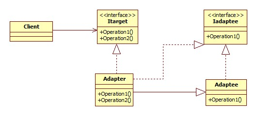
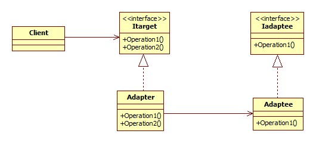

## php设计模式

### 1.单例模式

由于单例模式的设定，所以常应用于数据库类设计，它可以保证只连接一次数据库。
单例类的特点如下：
1）单例类不能直接实例化创建，只能由类本身实例化。因此，构造函数必须标记为private，从而防止类被实例化。
2）需要保证一个能访问到的实例公开的静态方法和一个私有静态成员变量来保存类实例。
3）类中通常需要有一个空的私有__clone()方法防止别人对单例类进行实例克隆。
示例代码如下：


```php
<?php  
	class Database  
	{   
		private static $instance;
		private function __construct()  
		{  
			// to do 
		}  
		private function __clone()   
		{  
			// to do  
		}  
		public static function getInstance()   
		{  
			if (!(self::$instance instanceof self)) {  
				self::$instance = new self();  
		}  
			return self::$instance;  
		}  
	}  
	$a =Database::getInstance();  
	$b =Database::getInstance();  
	print_r($a === $b);  
?>
```

### 2. 工厂模式

**那么何为工厂模式？**

　　从名字来看，似乎看不出什么端倪。工厂模式，和生产有关？还是和生产流程有关？难道还和工厂领导有关？和领导秘书有关？秘书...     好了不卖关子了，所谓工厂模式还真和生产有关。生产什么呢？生产出来的是**一个实例对象**。通过什么设备生产？通过**一个工厂类生产**。怎么生产呢？**工厂类调用自身静态方法来生产对象实例**。

  　**工厂模式有一个关键的构造，根据一般原则命名为Factory的静态方法，然而这只是一种原则，虽然工厂方法可以任意命名这个静态还可以接受任意数据的参数，必须返回一个对象。**

　　**为什么要用工厂模式？**

　　很多没接触过工厂模式的人会不禁问，为啥我要费那么大的劲儿去构造工厂类去创建对象呢？不去套用那些易维护，可扩展之类的话，我们可以考虑这样一个简单的问题。如果项目中，我们通过一个类创建对象。在快完成或者已经完成，要扩展功能的时候，发现原来的类类名不是很合适或者发现类需要添加构造函数参数才能实现功能扩展。我靠！我都通过这个类创建了一大堆对象实例了啊，难道我还要一个一个去改不成？我们现在才感受到了“高内聚低耦合”的博大精深。没问题，工厂方法可以解决这个问题。

　　再考虑一下，我要连接数据库，在php里面就有好几种方法，mysql扩展，mysqli扩展，PDO扩展。我就是想要一个对象用来以后的操作，具体要哪个，视情况而定喽。既然你们都是连接数据库的操作，你们就应该拥有相同的功能，建立连接，查询，断开连接...（此处显示接口的重要性）。总而言之，这几种方法应该“团结一致，一致对外”。如何实现呢？利用工厂模式。

​	相对于单例模式，上面我们提供了足够的信息，工厂类，工厂类里面的静态方法。静态方法里面new一下需要创建的对象实例就搞定了。当然至于考虑上面的第二个问题，根据工厂类静态方法的参数，我们简单做个判断就好了。管你用if..else..还是switch..case..，能快速高效完成判断该创建哪个类的工作就好了。最后，一定要记得，工厂类静态方法返回一个对象。不是两个，更不是三个。

```php
<?php

interface Transport{
    public function go();

}

class Bus implements Transport{
    public function go(){
        echo "bus每一站都要停";
    }
}

class Car implements Transport{
    public function go(){
        echo "car跑的飞快";
    }
}

class Bike implements Transport{
    public function go(){
        echo "bike比较慢";
    }
}

class transFactory{
    public static function factory($transport)
    {
        
        switch ($transport) {
            case 'bus':
                return new Bus();
                break;

            case 'car':
                return new Car();
                break;
            case 'bike':
                return new Bike();
                break;
        }
    }
}

$transport=transFactory::factory('car');
$transport->go();
```

### 3.注册树模式

**什么是注册树模式？**

　　注册树模式当然也叫注册模式，注册器模式。之所以我在这里矫情一下它的名称，是因为我感觉注册树这个名称更容易让人理解。像前两篇一样，我们这篇依旧是从名字入手。注册树模式通过将对象实例注册到一棵全局的对象树上，需要的时候从对象树上采摘的模式设计方法。     这让我想起了小时候买糖葫芦，卖糖葫芦的将糖葫芦插在一个大的杆子上，人们买的时候就取下来。不同的是，注册树模式摘下来还会有，能摘很多次，糖葫芦摘一次就没了。。。

　　**为什么要采用注册树模式？**

　　单例模式解决的是如何在整个项目中创建唯一对象实例的问题，工厂模式解决的是如何不通过new建立实例对象的方法。  那么注册树模式想解决什么问题呢？ 在考虑这个问题前，我们还是有必要考虑下前两种模式目前面临的局限。   首先，单例模式创建唯一对象的过程本身还有一种判断，即判断对象是否存在。存在则返回对象，不存在则创建对象并返回。  每次创建实例对象都要存在这么一层判断。 工厂模式更多考虑的是扩展维护的问题。  总的来说，单例模式和工厂模式可以产生更加合理的对象。怎么方便调用这些对象呢？而且在项目内如此建立的对象好像散兵游勇一样，不便统筹管理安排啊。因而，注册树模式应运而生。不管你是通过单例模式还是工厂模式还是二者结合生成的对象，都统统给我“插到”注册树上。我用某个对象的时候，直接从注册树上取一下就好。这和我们使用全局变量一样的方便实用。  而且注册树模式还为其他模式提供了一种非常好的想法。

　　**如何实现注册树？**

　　通过上述的描述，我们似乎很容易就找到了解决方法。首先我们需要一个作为注册树的类，这毋庸置疑。所有的对象“插入”到注册树上。这个注册树应该由一个静态变量来充当。而且这个注册树应该是一个二维数组。这个类应该有一个插入对象实例的方法（set()），当让相对应的就应该有一个撤销对象实例的方法（_unset()）。当然最重要的是还需要有一个读取对象的方法（get()）。拥有这些，我们就可以愉快地完成注册树模式啦~~~


```php
<?php
//注册树
class Register{
    protected static $objects;
    public static function set($alias,$object){
        self::$objects[$alias]=$object;
    }
    public static function get($alias){
        return self::$objects[$alias];
    }
    public static function _unset($alias){
        unset(self::$objects[$alias]);
    }
}

Register::set('rand',RandFactory::factory());

$object=Register::get('rand');

print_r($object);
```

### 4.观察者模式

开篇还是从名字说起，“观察者模式”的观察者三个字信息量很大。玩过很多网络游戏的童鞋们应该知道，即便是斗地主，除了玩家，还有一个角色叫“观察者"。在我们今天他谈论的模式设计中，观察者也是如此。首先，要有一个“主题”。只有有了一个主题，观察者才能搬着小板凳儿聚在一堆。其次，观察者还必须要有自己的操作。否则你聚在一堆儿没事做也没什么意义。

　　　从面向过程的角度来看，首先是观察者向主题**注册**，注册完之后，主题再**通知**观察者做出相应的**操作**，整个事情就完了。

　　　从面向对象的角度来看，主题提供注册和通知的接口，观察者提供自身操作的接口。（这些观察者拥有一个同一个接口。）观察者利用主题的接口向主题注册，而主题利用观察者接口通知观察者。耦合度相当之低。

​         如何实现观察者注册？通过前面的注册者模式很容易给我们提供思路，把这些对象加到一棵注册树上就好了嘛。如何通知？这就更简单了，对注册树进行遍历，让每个对象实现其接口提供的操作。

```php
<?php
// 主题接口
interface Subject{
    public function register(Observer $observer);
    public function notify();
}
// 观察者接口
interface Observer{
    public function watch();
}
// 主题
class Action implements Subject{
     public $_observers=array();
     public function register(Observer $observer){
         $this->_observers[]=$observer;
     }

     public function notify(){
         foreach ($this->_observers as $observer) {
             $observer->watch();
         }

     }
 }

// 观察者
class Cat implements Observer{
     public function watch(){
         echo "Cat watches TV<hr/>";
     }
 } 
 class Dog implements Observer{
     public function watch(){
         echo "Dog watches TV<hr/>";
     }
 } 
 class People implements Observer{
     public function watch(){
         echo "People watches TV<hr/>";
     }
 }


// 应用实例
$action=new Action();
$action->register(new Cat());
$action->register(new People());
$action->register(new Dog());
$action->notify();
```

### 5.适配器模式


适配器模式将一个类的换成客户端需要的另一个接口，使原本不兼容的接口能一起工作。一个现实中的例子，假如屋里墙上只有两项插口，而风扇有三个插头，这时需要再拿一个移动插线板，插线板接入墙壁插口的一段是两项插头，插线板另外一段能够提供三项插口给风扇，这时候插线板起到了一个适配器的作用。

在应用中，适配器模式分为**类适配器**和**对象适配器**。


**类适配器**



```php
interface ITarget
{
    function operation1();
    function operation2();
}
 
interface IAdaptee
{
    function operation1();
}
 
class Adaptee extends IAdaptee
{
    public  function operation1()
    {
        echo "原方法";
    }
}
 
class Adapter extends Adaptee implements IAdaptee, ITarget
{
    public  function operation2()
    {
        echo "适配方法";
    }
}
 
class Client
{
    public  function test()
    {
        $adapter = new Adapter();
        $adapter->operation1();//原方法
        $adapter->operation2();//适配方法
    }
}
```

**对象适配器**



类适配器使用的是继承模式，而对象适配器使用的是组合模式，将adaptee作为adapter的一个引用。

```php
interface ITarget
{
    function operation1();
    function operation2();
}
 
interface IAdaptee
{
    function operation1();
}
 
class Adaptee extends IAdaptee
{
    public  function operation1()
    {
        echo "原方法";
    }
}
 
class Adapter implements  ITarget
{
    private $adaptee;
 
    public function __construct($adaptee)
    {
        $this->adaptee = $adaptee;
    }
 
    public  function operation1()
    {
         return $this->adaptee->operation1();
    }
 
    public  function operation2()
    {
        echo "适配方法";
    }
}
 
 
class Client
{
    public  function test()
    {
        $adapter = new Adapter(new Adaptee(null));
        $adapter->operation1();//原方法
        $adapter->operation2();//适配方法
    }
}

```

由于组合在耦合性上小于继承，对象适配器显得更加灵活，当然它的缺点是增加代码量。 需要重写adapee中的方法的数量太大的话，可以考虑在adapter中使用__call方法委托adapee取得客户端调用的方法

```php
 public function __call($func, $args)
    {
        if (is_callable(array($this->adaptee, $func))) {
            return $this->adaptee->$func($args);
        }
        trigger_error('*********', E_USER_ERROR);
    }
```

