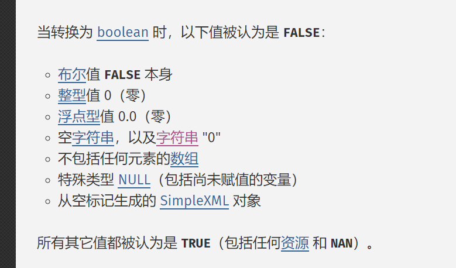
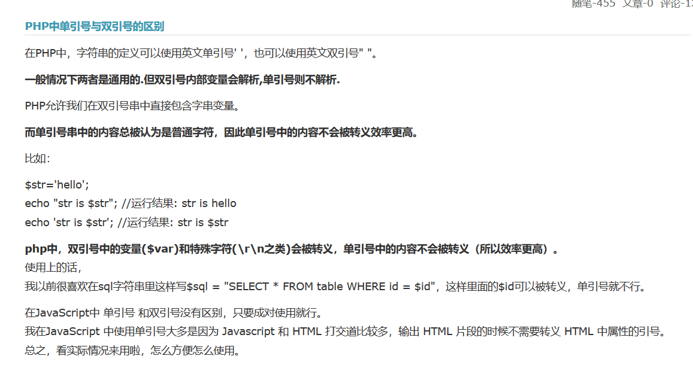

### php综合题

1. **变量如何定义？**

  ```php
  $
  
  变量以 $ 符号开头，其后是变量的名称
  
  变量名称必须以字母或下划线开头
  
  变量名称不能以数字开头
  
  变量名称只能包含字母数字字符和下划线（A-z、0-9 以及  _）
  
  变量名称对大小写敏感（$y 与 $Y 是两个不同的变量）
  ```

2. **如何检查变量是否定义？**
    isset()

3. **如何删除一个变量？**
    unset()

4. **判断一个变量是否为空的函数？**
    empty()

5. **什么是可变变量？**
    获取一个普通变量的值作为这个可变变量的变量名。

  ```php
  什么是可变变量？
  
  PHP提供了一种其他类型的变量——可变变量。可变变量允许我们动态地改变一个变量的名称。
  可以看到，在这方面，PHP具有非常大的自由度——所有的语言都允许改变变量的值，但是并没有太多的语言允许改变变量的类型，至于支持改变变量的名称的语言就更少了。
  
  这个特性的工作原理是用一个变量的值作为另一个变量的名称。例如：
  
  $varname = 'tireqty';
  
  
  
  于是，我们就可以用
  
  $$varname = 5;
  
  
  
  这个代码等价于：
  
  $tireqty = 5;
  
  
  在实际使用中，我们可以不用单独列出并使用每一个表单变量，我们可以使用一个循环语句和一个变量来自动处理它们。结合“for循环”，举例如下：
  orderform.html的主要内容
  
  [php] view plain copy
  <pre name="code" class="html"><form action="test.php" method="post">  
  <table border="0">  
  <tr bgcolor="#cccccc">  
  <td width="150">Item</td>  
  <td width="15">Quantity</td>  
  </tr>  
  <tr>  
  <td>Tires</td>  
  <td align="center"><input type="text" name="tireqty" size="3" maxlength="3" /></td>  
  </tr>  
  <tr>  
  <td>Oil</td>  
  <td align="center"><input type="text" name="oilqty" size="3" maxlength="3" /></td>  
  </tr>  
  <tr>  
  <td>Spark Plugs</td>  
  <td align="center"><input type="text" name="sparkqty" size="3" maxlength="3" /></td>  
  </tr>  
  <tr>  
  <td colspan="2" align="center"><input type="submit" value="Submit Order" /></td>  
  </tr>  
  </table>  
  </form>  
  
  
  表单处理文件test.php
  传统的中规中矩的写法
  
  [php] view plain copy
  <?php  
  $oilqty = $_POST['oilqty'];  
  $tireqty = $_POST['tireqty'];  
  $sparkqty = $_POST['sparkqty'];  
  echo "<p>Your order is as follows:</p>";  
  echo "<br />\$oilqty=".$oilqty;  
  echo "<br />\$tireqty=".$tireqty;  
  echo "<br />\$sparkqty=".$sparkqty;  
  ?>  
  
  
  如果orderform.html里有很多表单变量，可以想像上面的赋值语句将会很长，而我们采用可变变量就可以优化为如下非常简洁的代码：
  
  [php] view plain copy
  <?php  
  foreach ($_POST as $key => $value) {  
  $$key = $value;  
  }  
  echo "<p>Your order is as follows:</p>";  
  echo "<br />\$oilqty=".$oilqty;  
  echo "<br />\$tireqty=".$tireqty;  
  echo "<br />\$sparkqty=".$sparkqty;  
  ?>  
  
  
  ```

  ```php
  延伸
  
  什么是PHP可变函数？
  
  PHP 支持可变函数的概念。这意味着如果一个变量名后有圆括号，PHP 将寻找与变量的值同名的函数，并且尝试执行它。可变函数可以用来实现包括回调函数，函数表在内的一些用途。
  
  可变函数不能用于例如 echo，print，unset()，isset()，empty()，include，require 以及类似的语言结构。需要使用自己的包装函数来将这些结构用作可变函数
  
  php可变函数应用实例：
  
  for example:
  
  我们在前端通过GET传一个name为myfunc1的值(www.admin122.com/?name=myfunc1)，这个值是你要调用的函数名
  
  [php] view plain copy
  $f=$_GET['name'];  
  $f();  
  function myfunc1(){  
  }  
  
  
  再来个例子，这次换成class和function一起
  有class A和class B以及class C，他们都有自己的函数
  还是前端传值，这次是两个一个class，一个function
  同样的
  
  [php] view plain copy
  $class=$_GET['class'];  
  $func=$_GET['func'];  
  $obj=new $class();  
  $obj->$func();  
  
   
  这是做单入口模式的思路。PHP框架的思想。
  
  转载自：https://blog.csdn.net/river131/article/details/50598750
  
  多说一嘴：本来以为只是可变变量只是把原变量的值作为新变量的名字：
  
  $first ="hello";
  $hello ="world";
  echo $first." ".$$first;
  结果是  hello world
  
    
  
  后来看完博主的博客才知道，原来在foreach循环里面，还可以每次动态的给变量赋值，
  
  //这一句代码实在是秒
  $$key = $value
  
  
  end
  ```

  

6. **php中变量有哪些基本数据类型？**
    php支持8种原始数据类型。
    包括：
    四种标量类型（布尔型boolean，整型integer，浮点型float/double , 字符串string）
    两种复合类型(数组array ， 对象object)
    两种特殊类型（资源resource，NULL）


7. **其它类型转换为boolean类型时，哪些被认为是false？**
    布尔值false，整型值0， 浮点型值0.0， 空白字符串， 字符串'0', 空数组，空对象， 特殊数据类型NULL, 没有设定的变量。

8. empty()函数取值情况

  

9. **php中单引号与双引号的区别**  

10. **标量数据和数组的最大区别是什么？**
    一个标量只能存放一个数据，而数组可以存放多个数据。

11. **常量如何定义? 如何检测一个常量是否被定义？**
      define() , defined()

12. **常量的值只能是哪些数据类型？**
    常量的值只能是标量类型的数据。

13. **常量分为系统内置常量和自定义常量。请说出最常见的几个系统内置常量？**
    __FILE__ , __LINE__ , PHP_OS , PHP_VERSION

14. **如果定义了两个相同的常量，前者和后者哪个起作用？**
    前者起作用，因为常量一旦定义就不能被重新定义或者取消定义。

15. **常量和变量有哪些区别？**
    1）常量前没有$符号；
    2）常量只能通过define()定义，而不能通过赋值语句定义；
    3）常量可以在任何地方定义和访问，而变量定义的访问有固定的规则；
    4）常量一旦定义就不能被重新定义或者取消定义，而变量而通过赋值方式重新定义；
    5）常量的值只能是标量数据，而变量的数据库类型有8中原始数据类型。


14. **PHP中常用的几个预定义的全局数组变量是哪些？**
    有9大预定义的内置数组变量：
    $_POST, $_GET, $_REQUEST, $_SESSION, $_COOKIE, $_FILES，$_SERVER, $_ENV, $GLOBALS

15. **在实际开发中，常量最常用于哪些地方？**
    1）连接数据库的信息定义成常量，如数据库服务器的用户名、密码、数据库名、主机名；
    2）将站点的部分路径定义成常量，如web绝对路径，smarty的安装路径，model、view或者controller的文件夹路径；
    3）网站的公共信息，如网站名称，网站关键词等信息。

16. 函数的优越性有哪些？

17. **函数名起名有哪些规范？函数名区分大小写吗？**
    1）函数名以字母或者下划线开头；
    2）函数名不区分大小写；
    3）函数名不可以使用已经声明过的或者系统自建的函数名称。

18. **什么是变量的能见度？**
    就是变量在程序中的可作用范围。根据变量的能见度，变量分为局部变量和全局变量。

19. **什么是局部变量和全局变量？函数内是否可以直接调用全局变量？**
    局部变量是函数内部定义的变量，其作用域是所在的函数。如果函数外还有一个跟局部变量名字一样的变量，
    程序会认为它们两个是完全不同的两个变量。当退出函数的时候，其中的局部变量就同时被清除。

    全局变量是定义在所有函数以外的变量，其作用域是整个php文件，但是在用户自定义的函数内部是无法使用的。
    如果一定要在用户自定义的函数内部使用全局变量，那么就需要使用global关键字声明。
    也就是说如果在函数内的变量前加上golbal来修饰，那么函数内部就可以访问到这个全局变量，
    不仅可以利用这个全局变量进行运算而且可以对这个全局变量进行重新赋值。


20. **global关键词如何使用？预定义的全局变量数组$GLOBALS如何使用？**

    $GLOBALS['var']是外部的全局变量本身

    global $var是对外部$var的同名变量的引用或者指针，并不是真正的赋值

    $GLOBALS 是一个关联数组，每一个变量为一个元素，键名对应变量名，值对应变量的内容。$GLOBALS 之所以在全局范围内存在，是因为 $GLOBALS 是一个超全局变量。

21. **什么是静态变量？**

    静态变量 类型说明符是static。

    静态变量属于静态存储方式，其存储空间为内存中的静态数据区（在静态存储区内分配存储单元），该  区域中的数据在整个程序的运行期间一直占用这些存储空间（在程序整个运行期间都不释放），也可以认为是其内存地址不变，直到整个程序运行结束（相反，而   auto自动变量，即动态局部变量，属于动态存储类别，占动态存储空间，函数调用结束后即释放）。静态变量虽在程序的整个执行过程中始终存在，但是在它作  用域之外不能使用。

    另外，属于静态存储方式的变量不一定就是静态变量。 例如：外部变量(在PHP中指全局变量)虽属于静态存储方式，但不一定是静态变量，必须由 static加以定义后才能成为静态外部变量，或称静态全局变量。

    所有的全局变量都是静态变量，而局部变量只有定义时加上类型修饰符static，才为局部静态变量。

    静态变量可以在任何可以申请的地方申请，一旦申请成功后，它将不再接受其他的同样申请。

    静态变量并不是说其就不能改变值，不能改变值的量叫常量。 其拥有的值是可变的 ，而且它会保持最新的值。说其静态，是因为它不会随着函数的调用和退出而发生变化。即上次调用函数的时候，如果我们给静态变量赋予某个值的话，下次函数调用时，这个值保持不变。

22. **php中函数传递参数的方式有哪些？两者有什么区别？**
    按值传递和按地址传递（或按引用传递）

    1.传值，是把实参的值赋值给行参
    那么对行参的修改，不会影响实参的值
    2、传地址

    是传值的一种特殊方式，只是他传递的是地址，不是普通的如int
    那么传地址以后，实参和行参都指向同一个对象
    3、传引用

    真正的以地址的方式传递参数
    传递以后，行参和实参都是同一个对象，只是他们名字不同而已

    对行参的修改将影响实参的值

23. **什么是递归函数？如何进行递归调用？**
    递归函数其实就是调用自身的函数，但是必须满足以下两个条件：
    1）在每一次调用自身时，必须是更接近于最终结果；
    2）必须有一个确定的递归终止条件，不会造成死循环。
    举例说明：
    在实际工作中往往会在遍历文件夹的时候使用。
    如果有个例子是希望获取到目录windows下所有的文件，那么先遍历windows目录，如果发现其中还有文件夹，那么就会调用自身，继续往下寻找，依次类推，
    直到遍历到再也没有文件夹为止，这也就是意味着遍历出来了所有的文件。

24. **include()和require()函数的用法和区别是什么？**

    都是包含一个文件，如果未引入成功, include会报warning,试图继续执行.
    require则会fatal error, 停止执行.
    加_once的作用在于只引入一次.


25. **说出前置++和后置++的区别？**

    ++a表示取a的地址，增加它的内容，然后把值放在寄存器中；

    a++表示取a的地址，把它的值装入寄存器，然后增加内存中的a的值；

    前置++和后置++，有4点不同：

    1、返回类型

    前置++的返回类型是&，后置++的返回类型const值。这意味着，前置++返回的是左值（可以被修改，也就是说可以对它进行前置++、后置++、赋值等操作），后置++返回的是右值（不可以被修改，自然就不能对它进行前置++、后置++、赋值等操作）。

    2、形参不同

    前置++与后置++的操作符重载函数，函数原型必须不同。否则就违反了“重载函数必须拥有不同的函数原型”的语法规定。

    虽然前置++与后置++的返回类型不同，但是返回类型不属于函数原型。为了绕过语法限制，只好给后置++增加了一个int形参。

    3、代码不同

    前置++的实现比较简单，自增之后，将*this返回即可。需要注意的是，一定要返回*this。

    后置++的实现稍微麻烦一些。因为要返回自增之前的对象，所以先将对象拷贝一份，再进行自增，最后返回那个拷贝。

    4、效率不同

    如果不需要返回自增之前的值，那么前置++和后置++的计算效果都一样。但是，我们仍然应该优先使用前置++，尤其是对于用户自定义类型的自增操作。

    前置++的效率更高，理由是：后置++会生成临时对象。

    

26. **什么是三目（或三元）运算符？**
    表达式1?表达式2:表达式3

27. switch语句使用的注意事项有哪些？

28.break和continue使用过程中有哪些区别？
	break可以终止循环。
	continue没有break强大，只能终止本次循环而进入到下一次循环中。


29. 数组根据索引分为哪两种，如何区分？
    数字索引数组和关联数组。

30. 数组的赋值方式有哪两种？
    数组的声明方式主要有两种。
    1.通过array()函数声明数组；
    	可以通过key=>value的方式分别定义索引和值，也可以不定义数组的索引下标，只给出数组的元素值。
    2.直接为数组元素赋值,不需要调用array()函数。例如：
    	$arr[0] = 1;
    	$arr[1] = 2;

31.数组如何遍历？
	foreach()

32. foreach数组的时候指针是如何指向的？list()/each()/while()循环数组的时候指针如何指向的呢？
    当foreach开始执行的时候，数组内部的指针会自动指向第一个单元。因为foreach所操作的是指定数组的拷贝，而不是该数组本身。
    而each()一个数组后，数组指针将停留在数组中的下一个单元或者碰到数组结尾时停留在最后一个单元。如果要再次使用each()遍历数组，必须要使用reset().
    reset()将数组的内部指针倒回到第一个单元并返回第一个数组单元的值。

33. 如何计算数组长度（或者说计算数组中所有元素的个数）？字符串怎么取长度？
    count() -- 计算数组中的元素个数。
    可以使用count(数组名)或者count(数组名,1),如果有第二个参数，并且是数字1，则表示递归统计数组元素的个数。
    如果第二个参数是数字0，则等同于只有一个参数的count()函数。
    sizeof() -- count() 的别名
    字符串：strlen()、mb_strlen();

34. 数组排序的常用函数？数组合并的常用函数？
    sort(), array_merge();+array_combine();
35. 


35. 字符串定义的时候单引号和双引号有什么区别？

36. echo()和print()的区别是什么？

37. 按照分类说说都有哪些字符串处理函数？这些函数的作用是什么？

38. 正则表达式是什么？php中有哪些常用的跟正则相关的函数？
    正则表达式是用于描述字符排列模式的一种语法规则。正则表达式也叫做模式表达式。
    网站开发中正则表达式最常用于表单提交信息前的客户端验证。
    比如验证用户名是否输入正确，密码输入是否符合要求，email、手机号码等信息的输入是否合法。
    在php中正则表达式主要用于字符串的分割、匹配、查找和替换操作。


    preg系列函数可以处理。具体有以下几个：
    
    string preg_quote ( string str [, string delimiter] )
    	转义正则表达式字符 正则表达式的特殊字符包括：. \\ + * ? [ ^ ] $ ( ) { } = ! < > | :。
    preg_replace -- 执行正则表达式的搜索和替换
    mixed preg_replace ( mixed pattern, mixed replacement, mixed subject [, int limit] )
    preg_replace_callback -- 用回调函数执行正则表达式的搜索和替换
    mixed preg_replace_callback ( mixed pattern, callback callback, mixed subject [, int limit] )
    preg_split -- 用正则表达式分割字符串
    array preg_split ( string pattern, string subject [, int limit [, int flags]] )


39. 获取当前时间戳的函数主要有哪些？

40. header()函数主要的功能有哪些？使用过程中注意什么？

41. empty()函数哪些情况下返回true？
    布尔值false，
    整型值0， 
    浮点型值0.0， 
    空白字符串， 
    字符串'0', 
    array()空数组，
    特殊数据类型NULL, 
    没有任何属性的对象，
    没有赋值的变量。

42. 连接数据库操作的步骤是什么？每一步的返回值是什么数据类型？

$coon = mysql_connect('localhost', 'root' ,''); //返回资源类型
mysql_select_db('bbs', $coon);	// 布尔类型
mysq_query('set names utf8');  //布尔类型
$qry = mysql_query('select * from bbsinfo');  // 资源类型
mysql_fetch_row($qry)；	// 数组类型


43. 说说mysql_affected_rows(),mysql_insert_id()的用法？

44. 列举常用的文件处理函数，分别返回什么数据类型？
    // 对文件操作
    $file = "a.txt"; 
    $fp = fopen($file, 'a+');	// 资源类型
    $fd = fread($fp, 10);		// 字符串
    $fw = fwrite($fp, '国家宁'); // 整型(写入的长度)

45. 文件上传需要注意哪些细节？怎么把文件保存到指定目录？怎么避免上传文件重名问题？
    1.首现要在php.ini中开启文件上传；
    2.在php.ini中有一个允许上传的最大值，默认是2MB。必要的时候可以更改；
    3.上传表单一定要记住在form标签中写上enctype="multipart/form-data"；
    4.要注意上传文件的大小、文件类型是否符合要求，上传后存放的路径是否存在。

    可以通过上传的文件名获取到文件后缀，然后使用时间戳+文件后缀的方式为文件重新命名，这样就避免了重名。
    可以自己设置上传文件的保存目录，与文件名拼凑形成一个文件路径，使用move_uploaded_file()，就可以完成
    将文件保存到指定目录。


46. $_FILES是几维数组？第一维和第二维的索引下标分别是什么？
    二维数组。第一维是上传控件的name，二维下标分别为name/type/tmp_name/size/error.

47. 什么是ajax？ajax的原理是什么？ajax的核心技术是什么？ajax的优缺点是什么？
    ajax是asynchronous javascript and xml的缩写，是javascript、xml、css、DOM等多个技术的组合。

    Ajax的工作原理是一个页面的指定位置可以加载另一个页面所有的输出内容，这样就实现了一个静态页面也能获取到
    数据库中的返回数据信息了。所以ajax技术实现了一个静态网页在不刷新整个页面的情况下与服务器通信，
    减少了用户等待时间，同时也从而降低了网络流量，增强了客户体验的友好程度。

    Ajax的优点是：
    1.  减轻了服务器端负担，将一部分以前由服务器负担的工作转移到客户端执行，利用客户端闲置的资源进行处理；
    2.  在只局部刷新的情况下更新页面，增加了页面反应速度，使用户体验更友好。
        Ajax的缺点是不利于seo推广优化，因为搜索引擎无法直接访问到ajax请求的内容。
        ajax的核心技术是XMLHttpRequest，它是javascript中的一个对象。

48. jquery是什么？jquery简化ajax后的方法有哪些？

49. 什么是会话控制？

50. 使用cookie的注意事项有哪些？
    1） setcookie()之前不可以有任何页面输出，就是空格，空白行也不可以；
    2） setcookie()后，在当前页面调用$_COOKIE['cookiename']不会有输出，必须刷新或到下一个页面才可以看到cookie值；
    3） 不同的浏览器对cookie处理不同，客户端可以禁用cookie，浏览器也可以闲置cookie的数量，一个浏览器能创建的cookie数量最多300个，并且每个不可以超过4kb，
    每个web站点能设置的cookie总数不能超过20个。
    4） cookie是保存在客户端的，用户禁用了cookie，那么setcookie就不会起作用了。所以不可以过度依赖cookie。

51. 使用session的时候，通过什么来表示当前用户，从而与其他用户进行区分？
    sessionid，通过session_id()函数可以取得当前的session_id。

52. session和cookie的使用步骤分别是什么？什么是sesssion和cookie的生命周期？session和cookie的区别是什么？
    cookie是保存在客户端机器的，对于未设置过期时间的cookie，cookie值会保存在机器的内存中，只要关闭浏览器则
    cookie自动消失。如果设置了cookie的过期时间，那么浏览器会把cookie以文本文件的形式保存到硬盘中，
    当再次打开浏览器时cookie值依然有效。

    session是把用户需要存储的信息保存在服务器端。每个用户的session信息就像是键值对一样存储在服务器端，
    其中的键就是sessionid，而值就是用户需要存储信息。服务器就是通过sessionid来区分存储的session信息是
    哪个用户的。

    两者最大的区别就是session存储在服务器端，而cookie是在客户端。session安全性更高，而cookie安全性弱。

    session在web开发中具有非常重要的份量。它可以将用户正确登录后的信息记录到服务器的内存中，当用户以此身份
    访问网站的管理后台时，无需再次登录即可得到身份确认。而没有正确登录的用户则不分配session空间，即便输入了
    管理后台的访问地址也不能看到页面内容。通过session确定了用户对页面的操作权限。

    使用session的步骤：
    1. 启动session：
        使用session_start()函数来启动。
    2. 注册会话：
         直接给$_SESSION数组添加元素即可。
    3. 使用会话：
        判断session是否为空或者是否已经注册，如果已经存在则像普通数组使用即可。
    4. 删除会话：
        1.可以使用unset删除单个session；
        2.使用$_SESSION=array()的方式，一次注销所有的会话变量；
        3.使用session_destroy()函数来彻底销毁session。


	cookie怎么使用？
	1. 记录用户访问的部分信息
	2. 在页面间传递变量
	3. 将所查看的internet页存储在cookies临时文件夹中，可以提高以后的浏览速度。
	
	创建cookie：
		setcookie(string cookiename , string value , int expire);
	读取cookie：
		通过超级全局数组$_COOKIE来读取浏览器端的cookie的值。
	删除cookie：有两种方法
		1.手工删除方法：
			右击浏览器属性，可以看到删除cookies，执行操作即可将所有cookie文件删除。
		2.setcookie()方法：
			跟设置cookie的方法一样，不过此时讲cookie的值设置为空，有效时间为0或小于当前时间戳。


43. 在实际开发中，session在哪些场合使用？
    session用来存储用户登录信息和用在跨页面传值。
    1）常用在用户登录成功后，将用户登录信息赋值给session；
    2）用在验证码图片生成，当随机码生成后赋值给session。

44. 注销session会话的形式有几种？

45. 什么是OOP?什么是类和对象？什么是类属性？OOP的三大特性是什么？
    OOP(object oriented programming)，即面向对象编程，其中两个最重要的概念就是类和对象。
    世间万物都具有自身的属性和方法，通过这些属性和方法可以区分出不同的物质。
    属性和方法的集合就形成了类，类是面向对象编程的核心和基础，
    通过类就将零散的用于实现某个功能的代码有效地管理起来了。

    类只是具备了某些功能和属性的抽象模型，而实际应用中需要一个一个实体，也就是需要对类进行实例化，
    类在实例化之后就是对象。


	OOP具有三大特点：
	1. 封装性：
	   也称为信息隐藏，就是将一个类的使用和实现分开，只保留部分接口和方法与外部联系，或者说只公开了一些供开发人员使用的方法。
	   于是开发人员只需要关注这个类如何使用，而不用去关心其具体的实现过程，这样就能实现MVC分工合作，也能有效避免程序间相互依赖，
  	 实现代码模块间松藕合。

	2. 继承性：
	   就是子类自动继承其父级类中的属性和方法，并可以可以添加新的属性和方法或者对部分属性和方法进行重写。继承增加了代码的可重用性。
	   php只支持单继承，也就是说一个子类只能有一个父类。
	
	3. 多态性：
	   子类继承了来自父级类中的属性和方法，并对其中部分方法进行重写。
	   于是多个子类中虽然都具有同一个方法，但是这些子类实例化的对象调用这些相同的方法后却可以获得完全不同的结果，这种技术就是多态性。
	   多态性增强了软件的灵活性。


46. 常用的属性的访问修饰符有哪些？分别代表什么含义？
    private，protected，public。如果不使用这三个关键词，也可以使用var关键字。但是var不可以跟权限修饰词一起使用。


47. $this和self、parent这三个关键词分别代表什么？在哪些场合下使用？


48.类中如何定义常量、如何类中调用常量、如何在类外调用常量。
	类中的常量也就是成员常量，常量就是不会改变的量，是一个恒值。
	定义常量使用关键字const.
	例如：const PI = 3.1415326;
	无论是类内还是类外，常量的访问和变量是不一样的，常量不需要实例化对象，
	访问常量的格式都是类名加作用域操作符号（双冒号）来调用。
	即：类名 :: 类常量名; 


48. 作用域操作符::如何使用？

49. 什么是魔术方法？常用的魔术方法有哪几个？

50. 什么是构造方法和析构方法？
    构造方法就是在实例化一个对象的同时自动执行的成员方法，作用就是初始化对象。
    php5之前，一个跟类名完全相同的方法是构造方法，php5之后魔术方法__construct()就是构造方法。
    如果类中没有定义构造方法，那么php会自动生成一个，这个自动生成的构造方法没有任何参数，
    没有任何操作。
    构造方法的格式如下：
    function __construct(){}
    或者：function 类名(){}
    构造方法可以没有参数，也可以有多个参数。

    析构方法的作用和构造方法正好相反，是对象被销毁时被自动调用的，作用是释放内存。
    析构方法的定义方法为：__destruct();
    因为php具有垃圾回收机制，能自动清除不再使用的对象，释放内存，一般情况下可以不手动创建析构方法。

51. __autoload()方法的工作原理是什么？
    使用这个魔术函数的基本条件是类文件的文件名要和类的名字保持一致。
    当程序执行到实例化某个类的时候，如果在实例化前没有引入这个类文件，那么就自动执行__autoload()函数。
    这个函数会根据实例化的类的名称来查找这个类文件的路径，当判断这个类文件路径下确实存在这个类文件后
    就执行include或者require来载入该类，然后程序继续执行，如果这个路径下不存在该文件时就提示错误。
    使用自动载入的魔术函数可以不必要写很多个include或者require函数。


52. 什么是抽象类和接口？抽象类和接口有什么不同和相似的地方？
    抽象类是一种不能被实例化的类，只能作为其他类的父类来使用。
    抽象类是通过关键字 abstract 来声明的。
    抽象类与普通类相似，都包含成员变量和成员方法，两者的区别在于，抽象类中至少要包含一个抽象方法，
    抽象方法没有方法体，该方法天生就是要被子类重写的。
    抽象方法的格式为：abstract function abstractMethod();
    	
    因为php中只支持单继承，如果想实现多重继承，就要使用接口。也就是说子类可以实现多个接口。
    接口类是通过interface关键字来声明的，接口类中的成员常量和方法都是public的，方法可以不写关键字public，
    接口中的方法也是没有方法体。接口中的方法也天生就是要被子类实现的。

    抽象类和接口实现的功能十分相似，最大的不同是接口能实现多继承。在应用中选择抽象类还是接口要看具体实现。
    子类继承抽象类使用extends，子类实现接口使用implements。


53. __call的参数有几个，类型是什么，意义是什么？
    魔术方法__call()的作用是当程序调用一个不存在或不可见的成员方法时，php会先调用__call()方法，
    将那个不存在的方法的方法名和参数都存储下来。
    __call()包含两个参数，第一个参数是那个不存在的方法的方法名，是个字符串类型；
    第二个参数是那个不存在的方法的所有参数，是个数组类型。

    本人认为__call()方法的意义更多在于调试，可以定位到错误。同时可以捕捉异常，如果某个方法不存在，
    则执行其它可替代方法。


54. 字符串怎么转成整数，有几种方法？怎么实现？
    强制类型转换: (整型)字符串变量名;
    直接转换：settype(字符串变量,整型);
    intval(字符串变量);

55.页面字符出现乱码，怎么解决?
	1.首先考虑当前文件是不是设置了字符集。查看是不是meta标签中写了charset，如果是php页面还可以看看是不是
	在header()函数中指定了charset；
	2.如果设置了字符集（也就是charset），那么判断当前文件保存的编码格式是否跟页面设置的字符集保持一致，
	两者必须保持统一；
	3.如果涉及到从数据库提取数据，那么判断数据库查询时的字符集是否跟当前页面设置的字符集一致，两者必须统一。


56.说出数组涉及到的常用函数。
	array --  声明一个数组
	count -- 计算数组中的单元数目或对象中的属性个数
	foreach -- 遍历数组
	list -- 遍历数组
	explode -- 将字符串转成数组
	implode -- 将数组转成一个新字符串
	array_merge -- 合并一个或多个数组
	is_array -- 检查是否是数组		

	print_r -- 输出数组
	sort -- 数组排序
	
	array_keys -- 返回数组中所有的键名
	array_values -- 返回数组中所有的值
	key -- 从关联数组中取得键名


57. smarty模板技术的用途是什么？

58. smarty配置主要有哪几项？

59. smarty在使用过程中需要注意哪些细节？
    Smarty是基于MVC概念的一种模板引擎，它将一个页面程序分成了两部分来实现：即视图层和控制层，
    也就是说smarty技术将用户UI与php代码分离开。
    这样程序员和美工各司其职，互不干扰。

    smarty运用过程中要注意以下几个问题：
    1.正确配置smarty。主要要配置smarty模板文件的路径；
    2.php页面中使用assign赋值 和 display显示页面；
    3.smarty模板文件中不允许出现php代码段，所有的注释，变量，函数都要包含在定界符内。

60. 什么是MVC？MVC的目的是什么？