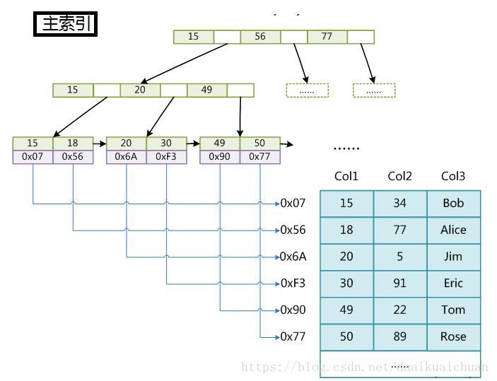

#### 堆和栈的区别：
一.堆栈空间分配区别：

1.栈（[操作系统](https://www.baidu.com/s?wd=%E6%93%8D%E4%BD%9C%E7%B3%BB%E7%BB%9F&tn=SE_PcZhidaonwhc_ngpagmjz&rsv_dl=gh_pc_zhidao)）：由[操作系统](https://www.baidu.com/s?wd=%E6%93%8D%E4%BD%9C%E7%B3%BB%E7%BB%9F&tn=SE_PcZhidaonwhc_ngpagmjz&rsv_dl=gh_pc_zhidao)自动分配释放 ，存放函数的参数值，局部变量的值等。其操作方式类似于数据结构中的栈；

2.堆（[操作系统](https://www.baidu.com/s?wd=%E6%93%8D%E4%BD%9C%E7%B3%BB%E7%BB%9F&tn=SE_PcZhidaonwhc_ngpagmjz&rsv_dl=gh_pc_zhidao)）： 一般由程序员分配释放， 若程序员不释放，程序结束时可能由OS回收，分配方式倒是类似于链表。

二.堆栈缓存方式区别：

1.栈使用的是[一级缓存](https://www.baidu.com/s?wd=%E4%B8%80%E7%BA%A7%E7%BC%93%E5%AD%98&tn=SE_PcZhidaonwhc_ngpagmjz&rsv_dl=gh_pc_zhidao)， 他们通常都是被调用时处于存储空间中，调用完毕立即释放；

2.堆是存放在二级缓存中，生命周期由虚拟机的[垃圾回收](https://www.baidu.com/s?wd=%E5%9E%83%E5%9C%BE%E5%9B%9E%E6%94%B6&tn=SE_PcZhidaonwhc_ngpagmjz&rsv_dl=gh_pc_zhidao)算法来决定（并不是一旦成为孤儿对象就能被回收）。所以调用这些对象的速度要相对来得低一些。

三.堆栈数据结构区别：

堆（数据结构）：堆可以被看成是一棵树，如：堆排序；

栈（数据结构）：一种先进后出的数据结构。

#### 二叉树

        二叉树binary tree是指每个节点最多含有两个子树的树结构。

特点：

        1.所有节点最多拥有两个子节点，即度不大于2
    
        2.左子树的键值小于根的键值，右子树的键值大于根的键值。

因为二叉树只是定义了简单的结构，所以存在多种深度可能，导致二叉树的效率低，所以引入了平衡二叉树。

#### 平衡二叉树
2.1 avl树

        平衡二叉树，基于avl算法，即是avl树（avl tree）

特点：

        1.符合二叉树的条件下
    
        2.任何节点的两个子树的高度最大差为1
    
        如果在avl 树，中进行插入和删除节点操作，可能导致avl树失去平衡，那么可以通过旋转重新达到平衡。因此我们说的二叉树也称自平衡二叉树。
####  红黑树

        红黑树和avl树类似，都是在进行插入和删除操作时通过特定的操作保持二叉树的平衡，从而获得较高的查找性能。

在java中TreeSet，TreeMap的底层就是用的这个方法。

特点：

        1.节点是红色或黑色
    
        2.根节点是黑色
    
        3.叶子节点（nil,空节点）是黑色
    
        4.每个红色节点的两个子节点都是黑色
####  B-tree

        B通常理解成是Balance的意思，B- tree 就是B树，简称平衡树。
    
        B树是平衡多路查找树（有多个查找路径，不止2个），是一种平衡的多叉树。因为B树是平衡树，每个节点到叶子节点的高度都是相同的，这样可以保证B树的查询是稳定的。
    
        使用B tree 可以显著减少定位记录时所经历的中间过程，从而快速定位，加快存取速度。
    
        与二叉树相比，B-tree利用多个分支（二叉树只有2个分支）节点，减少了获取记录时所经历的节点数，从而达到节省存取时间的目的。

特点：

        1.每个节点的关键字增多了，特别是B树应用到数据库中的时候。
    
        数据库充分利用了磁盘块的原理（磁盘数据的存储采用的是块的形式进行存储，每个块的大小一般为4k,每次去取数据的时候，就是取出这个4k的大小，而不是只取出你想要的大小。就是说每次IO的时候，同一磁盘块的数据都是一次性提取出来）。把树的节点关键字增多后，树的层级比原来二叉树的层级少了，这样就可以减少数据查找的次数 ，降低复杂度了。
    
        2.所有的页节点都在同一层上
#### B+ tree

        B+tree 是在 B- tree基础上的优化，使其更适应存储索引结构
    
        B- tree的结构中，每个节点不仅包括数据的key值，也包括data值。而每一页的存储空间都是有限的，如果data数据较大的时候，会导致，每一页中存储的key比较少，当存储的数据量比较大时，同样会导致B- tree的查询深度很大，增加磁盘IO次数，进而影响查询效率
    
        B+ tree中，非叶子节点上只存储key的信息，这样可以加大每一页中存储key的数量，降低B+ tree的高度。

特点（与B- tree相比）：

        1.非叶子节点只存储key信息
    
        2.所有叶子节点之间有一个链指针
    
        3.B+的非叶子节点只进行数据的索引，不会存实际的关键字记录的指针，所有数据地址必须要到叶子节点才能获取到，所以每次数据查询的次数都一样。
    
        4.B+树的应用场景主要是数据库索引结构，数据库的查询有时候可能一次多条，如果分布在不同的层（树的层级），那么在取出数据后，还需要做排序。而在一个层级上，且有指针连接各个叶子节点也使得查询效率更高。

#### B树的结构：

 \1. 根节点至少有两个子节点 ；

 \2. 每个节点有M-1个key，并且以升序排列 ；

 \3. 位于M-1和M key的子节点的值位于M-1 和M key对应的Value之间 ；

 \4. 其它节点至少有M/2个子节点 ；

 \5. 所有叶子节点都在同一层 。

#### B+树

 B+树是B-树的变体，也是一种多路搜索树，其定义基本与B树相同，除了：

 \1. 非叶子结点的子树指针与关键字个数相同；

 \2. 非叶子结点的子树指针P[i]，指向关键字值属于[K[i], K[i+1])的子树（B-树是开区间）；

 \3. 为所有叶子结点增加一个链指针；

 \4. 所有关键字都在叶子结点出现。

**四、B树与B+树的对比**

  B和B+树的区别在于，B+树的非叶子结点只包含导航信息，不包含实际的值，所有的叶子结点和相连的节点使用链表相连，便于区间查找和遍历。

**1、B树的优点**

 \1. B树的每一个节点都包含key和value，因此经常访问的元素可能离根节点更近，因此访问也更迅速。

**2、B+树的优点**

 \1. 由于B+树在内部节点上不好含数据信息，因此在内存页中能够存放更多的key。 数据存放的更加紧密，具有更好的空间局部性。因此访问叶子几点上关联的数据也具有更好的缓存命中率；

 \2. B+树的叶子结点都是相链的，因此对整棵树的便利只需要一次线性遍历叶子结点即可。而且由于数据顺序排列并且相连，所以便于区间查找和搜索。而B树则需要进行每一层的递归遍历。相邻的元素可能在内存中不相邻，所以缓存命中性没有B+树好。

**3、应用**

  B树和B+树经常被用于数据库中，**作为MySQL数据库索引**。索引（Index）是帮助MySQL高效获取数据的数据结构。为了查询更加高效，所以采用B树作为数据库的索引。 

#### 队列和栈的区别

1、队列先进先出，栈先进后出。

2、对插入和删除操作的"限定"不同。

栈是限定只能在表的一端进行插入和删除操作的线性表。     

队列是限定只能在表的一端进行插入和在另一端进行删除操作的线性表。  

3、遍历数据速度不同。

栈只能从头部取数据，也就最先放入的需要遍历整个栈最后才能取出来，而且在遍历数据的时候还得为数据开辟临时空间，保持数据在遍历前的一致性。

队列则不同，它基于地址指针进行遍历，而且可以从头或尾部开始遍历，但不能同时遍历，无需开辟临时空间，因为在遍历的过程中不影像数据结构，速度要快的多

