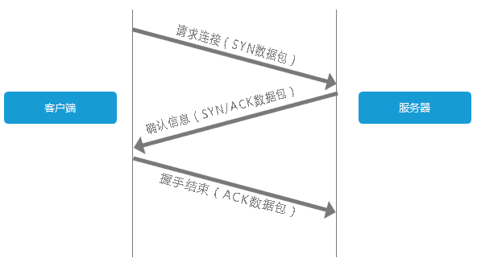
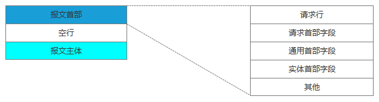
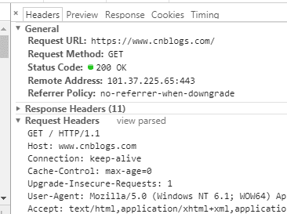
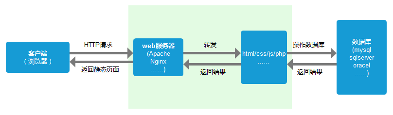
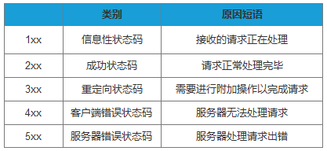
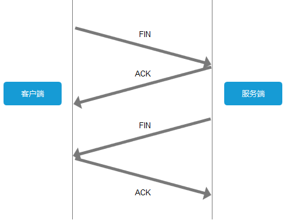

###   浏览器输入网址后会做什么

####  一、DNS域名解析

我们在浏览器输入网址，其实就是要向服务器请求我们想要的页面内容，所有浏览器首先要确认的是域名所对应的服务器在哪里。将域名解析成对应的服务器IP地址这项工作，是由DNS服务器来完成的。

客户端收到你输入的域名地址后，它**首先去找本地的hosts文件，检查在该文件中是否有相应的域名、IP对应关系，如果有，则向其IP地址发送请求，如果hosts里没有这个域名的映射，则查找本地DNS解析器缓存，是否有这个网址映射关系，如果有，直接返回，完成域名解析。**
如果hosts与本地DNS解析器缓存都没有相应的网址映射关系，首先会找TCP/ip参数中设置的首选DNS服务器，在此我们叫它本地DNS服务器，此服务器收到查询时，如果要查询的域名，包含在本地配置区域资源中，则返回解析结果给客户机，完成域名解析，此解析具有权威性。
如果要查询的域名，不由本地DNS服务器区域解析，但该服务器已缓存了此网址映射关系，则调用这个IP地址映射，完成域名解析，此解析不具有权威性。
如果本地DNS服务器本地区域文件与缓存解析都失效，则根据本地DNS服务器的设置（是否设置转发器）进行查询，如果未用转发模式，本地DNS就把请求发至13台根DNS，根DNS服务器收到请求后会判断这个域名(.com)是谁来授权管理，并会返回一个负责该顶级域名服务器的一个IP。本地DNS服务器收到IP信息后，将会联系负责.com域的这台服务器。这台负责.com域的服务器收到请求后，如果自己无法解析，它就会找一个管理.com域的下一级DNS服务器地址(qq.com)给本地DNS服务器。当本地DNS服务器收到这个地址后，就会找qq.com域服务器，重复上面的动作，进行查询，直至找到www.qq.com主机。
如果用的是转发模式，此DNS服务器就会把请求转发至上一级DNS服务器，由上一级服务器进行解析，上一级服务器如果不能解析，或找根DNS或把转请求转至上上级，以此循环。不管是本地DNS服务器用是是转发，还是根提示，最后都是把结果返回给本地DNS服务器，由此DNS服务器再返回给客户机。

#### 二、建立TCP链接

费了一顿周折终于拿到服务器IP了，**下一步自然就是链接到该服务器。对于客户端与服务器的TCP链接，必然要说的就是『三次握手』。**




客户端发送一个带有SYN标志的数据包给服务端，服务端收到后，回传一个带有SYN/ACK标志的数据包以示传达确认信息，最后客户端再回传一个带ACK标志的数据包，代表握手结束，连接成功。

上图也可以这么理解：

客户端：“你好，在家不，有你快递。”

服务端：“在的，送来就行。”

客户端：“好嘞。”

#### 三、发送HTTP请求

**与服务器建立了连接后，就可以向服务器发起请求了请求包括GET/POST、url、协议、浏览器头、cookies信息等**。这里我们先看下请求报文的结构（如下图）：



请求报文

在浏览器中查看报文首部（以google浏览器为例）：



请求行包括请求方法、URI、HTTP版本。首部字段传递重要信息，包括请求首部字段、通用首部字段和实体首部字段。我们可以从报文中看到发出的请求的具体信息。具体每个首部字段的作用，这里不做过多阐述。

#### 四、服务器处理请求

**服务器端收到请求后的由web服务器（准确说应该是http服务器）处理请求，诸如Apache、Ngnix、IIS等。web服务器解析用户请求，知道了需要调度哪些资源文件，再通过相应的这些资源文件处理用户请求和参数，并调用数据库信息，最后将结果通过web服务器返回给浏览器客户端。**



服务器处理请求

#### 五、返回响应结果

在HTTP里，有请求就会有响应，哪怕是错误信息。这里我们同样看下响应报文的组成结构：


响应报文


在响应结果中都会有个一个HTTP状态码，比如我们熟知的200、301、404、500等。通过这个状态码我们可以知道服务器端的处理是否正常，并能了解具体的错误。

状态码由3位数字和原因短语组成。根据首位数字，状态码可以分为五类：



状态码类别

#### 六、关闭TCP连接

**为了避免服务器与客户端双方的资源占用和损耗，当双方没有请求或响应传递时，任意一方都可以发起关闭请求。与创建TCP连接的3次握手类似，关闭TCP连接，需要4次握手。**



4次握手

上图可以这么理解：

客户端：“兄弟，我这边没数据要传了，咱关闭连接吧。”

服务端：“收到，我看看我这边有木有数据了。”

服务端：“兄弟，我这边也没数据要传你了，咱可以关闭连接了。”

客户端：“好嘞。”

#### 七、浏览器解析HTML

准确地说，浏览器需要加载解析的不仅仅是HTML，还包括CSS、JS。以及还要加载图片、视频等其他媒体资源。

浏览器通过解析HTML，生成DOM树，解析CSS，生成CSS规则树，然后通过DOM树和CSS规则树生成渲染树。渲染树与DOM树不同，渲染树中并没有head、display为none等不必显示的节点。

要注意的是，浏览器的解析过程并非是串连进行的，比如在解析CSS的同时，可以继续加载解析HTML，但在解析执行JS脚本时，会停止解析后续HTML，这就会出现阻塞问题，关于JS阻塞相关问题，这里不过多阐述,后面会单独开篇讲解。

#### 八、浏览器布局渲染

根据渲染树布局，计算CSS样式，即每个节点在页面中的大小和位置等几何信息。HTML默认是流式布局的，CSS和js会打破这种布局，改变DOM的外观样式以及大小和位置。这时就要提到两个重要概念：repaint和reflow。

> repaint：屏幕的一部分重画，不影响整体布局，比如某个CSS的背景色变了，但元素的几何尺寸和位置不变。
>
> reflow： 意味着元件的几何尺寸变了，我们需要重新验证并计算渲染树。是渲染树的一部分或全部发生了变化。这就是Reflow，或是Layout。

所以我们应该尽量减少reflow和repaint，我想这也是为什么现在很少有用table布局的原因之一。

最后浏览器绘制各个节点，将页面展示给用户。


### TCP三次握手，四次挥手


    序列号seq：占4个字节，用来标记数据段的顺序，TCP把连接中发送的所有数据字节都编上一个序号，第一个字节的编号由本地随机产生；给字节编上序号后，就给每一个报文段指派一个序号；序列号seq就是这个报文段中的第一个字节的数据编号。
    
    确认号ack：占4个字节，期待收到对方下一个报文段的第一个数据字节的序号；序列号表示报文段携带数据的第一个字节的编号；而确认号指的是期望接收到下一个字节的编号；因此当前报文段最后一个字节的编号+1即为确认号。
    
    确认ACK：占1位，仅当ACK=1时，确认号字段才有效。ACK=0时，确认号无效
    
    同步SYN：连接建立时用于同步序号。当SYN=1，ACK=0时表示：这是一个连接请求报文段。若同意连接，则在响应报文段中使得SYN=1，ACK=1。因此，SYN=1表示这是一个连接请求，或连接接受报文。SYN这个标志位只有在TCP建产连接时才会被置1，握手完成后SYN标志位被置0。
    
    终止FIN：用来释放一个连接。FIN=1表示：此报文段的发送方的数据已经发送完毕，并要求释放运输连接
    
    PS：ACK、SYN和FIN这些大写的单词表示标志位，其值要么是1，要么是0；ack、seq小写的单词表示序号。

字段 	含义
URG 	紧急指针是否有效。为1，表示某一位需要被优先处理
ACK 	确认号是否有效，一般置为1。
PSH 	提示接收端应用程序立即从TCP缓冲区把数据读走。
RST 	对方要求重新建立连接，复位。
SYN 	请求建立连接，并在其序列号的字段进行序列号的初始值设定。建立连接，设置为1
FIN     	希望断开连接。

 

**三次握手： **

（1）第一次握手：Client将标志位SYN置为1，随机产生一个值seq=J，并将该数据包发送给Server，Client进入SYN_SENT状态，等待Server确认。
 （2）第二次握手：Server收到数据包后由标志位SYN=1知道Client请求建立连接，Server将标志位SYN和ACK都置为1，ack=J+1，随机产生一个值seq=K，并将该数据包发送给Client以确认连接请求，Server进入SYN_RCVD状态。
 （3）第三次握手：Client收到确认后，检查ack是否为J+1，ACK是否为1，如果正确则将标志位ACK置为1，ack=K+1，并将该数据包发送给Server，Server检查ack是否为K+1，ACK是否为1，如果正确则连接建立成功，Client和Server进入ESTABLISHED状态，完成三次握手，随后Client与Server之间可以开始传输数据了。

 


**四次挥手： **

（1）第一次挥手：Client发送一个FIN，用来关闭Client到Server的数据传送，Client进入FIN_WAIT_1状态。

 （2）第二次挥手：Server收到FIN后，发送一个ACK给Client，确认序号为收到序号+1（与SYN相同，一个FIN占用一个序号），Server进入CLOSE_WAIT状态。

 （3）第三次挥手：Server发送一个FIN，用来关闭Server到Client的数据传送，Server进入LAST_ACK状态。

 （4）第四次挥手：Client收到FIN后，Client进入TIME_WAIT状态，接着发送一个ACK给Server，确认序号为收到序号+1，Server进入CLOSED状态，完成四次挥手。 	 

**常见面试题**

【问题1】为什么连接的时候是三次握手，关闭的时候却是四次握手？

答：因为当Server端收到Client端的SYN连接请求报文后，可以直接发送SYN+ACK报文。其中ACK报文是用来应答的，SYN报文是用来同步的。但是关闭连接时，当Server端收到FIN报文时，很可能并不会立即关闭SOCKET，所以只能先回复一个ACK报文，告诉Client端，"你发的FIN报文我收到了"。只有等到我Server端所有的报文都发送完了，我才能发送FIN报文，因此不能一起发送。故需要四步握手。

【问题2】为什么TIME_WAIT状态需要经过2MSL(最大报文段生存时间)才能返回到CLOSE状态？

答：虽然按道理，四个报文都发送完毕，我们可以直接进入CLOSE状态了，但是我们必须假象网络是不可靠的，有可以最后一个ACK丢失。所以TIME_WAIT状态就是用来重发可能丢失的ACK报文。在Client发送出最后的ACK回复，但该ACK可能丢失。Server如果没有收到ACK，将不断重复发送FIN片段。所以Client不能立即关闭，它必须确认Server接收到了该ACK。Client会在发送出ACK之后进入到TIME_WAIT状态。Client会设置一个计时器，等待2MSL的时间。如果在该时间内再次收到FIN，那么Client会重发ACK并再次等待2MSL。所谓的2MSL是两倍的MSL(Maximum Segment Lifetime)。MSL指一个片段在网络中最大的存活时间，2MSL就是一个发送和一个回复所需的最大时间。如果直到2MSL，Client都没有再次收到FIN，那么Client推断ACK已经被成功接收，则结束TCP连接。

【问题3】为什么不能用两次握手进行连接？

答：3次握手完成两个重要的功能，既要双方做好发送数据的准备工作(双方都知道彼此已准备好)，也要允许双方就初始序列号进行协商，这个序列号在握手过程中被发送和确认。

现在把三次握手改成仅需要两次握手，死锁是可能发生的。作为例子，考虑计算机S和C之间的通信，假定C给S发送一个连接请求分组，S收到了这个分组，并发 送了确认应答分组。按照两次握手的协定，S认为连接已经成功地建立了，可以开始发送数据分组。可是，C在S的应答分组在传输中被丢失的情况下，将不知道S 是否已准备好，不知道S建立什么样的序列号，C甚至怀疑S是否收到自己的连接请求分组。在这种情况下，C认为连接还未建立成功，将忽略S发来的任何数据分 组，只等待连接确认应答分组。而S在发出的分组超时后，重复发送同样的分组。这样就形成了死锁。

【问题4】如果已经建立了连接，但是客户端突然出现故障了怎么办？

TCP还设有一个保活计时器，显然，客户端如果出现故障，服务器不能一直等下去，白白浪费资源。服务器每收到一次客户端的请求后都会重新复位这个计时器，时间通常是设置为2小时，若两小时还没有收到客户端的任何数据，服务器就会发送一个探测报文段，以后每隔75秒钟发送一次。若一连发送10个探测报文仍然没反应，服务器就认为客户端出了故障，接着就关闭连接。

### tcp协议和udp协议的差别 

```
tcp协议和udp协议的差别 
           TCP           UDP 
是否连接     面向连接     面向非连接 
传输可靠性   可靠        不可靠 
应用场合    少量数据    传输大量数据 

速度       慢         快

```

**TCP定义**

 	TCP（Transmission Control Protocol 传输控制协议）是一种面向连接的、可靠的、基于字节流的传输层通信协议，由IETF的RFC 793定义。 

 


 	**UDP定义** 

 	UDP （User Datagram Protocol 用户数据报协议）是OSI（Open System Interconnection开放式系统互联） 参考模型中一种无连接的传输层协议，提供面向事务的简单不可靠信息传送服务 


TCP与UDP区别

 （1）TCP提供的是面向连接的、可靠的数据流传输；

​         UDP提供的是非面向连接的、不可靠的数据流传输。

 （2）TCP提供可靠的服务，通过TCP连接传送的数据，无差错、不丢失，不重复，按序到达；

​        UDP尽最大努力交付，即不保证可靠交付。

 （3）TCP面向字节流；

​        UDP面向报文。

 （4）TCP连接只能是点到点的；

​        UDP支持一对一、一对多、多对一和多对多的交互通信。

 （5） TCP首部开销20字节；

​        UDP的首部开销小，只有8个字节。

 （6）TCP的逻辑通信信道是全双工的可靠信道；

​        UDP的逻辑通信信道是不可靠信道。


 ###  列举几种常见的协议，并简述他们的作用             

ICMP协议：因特网控制报文协议。它是TCP/IP协议族的一个子协议，用于在IP主机、路由器之间传递控制消息。

 TFTP协议：是TCP/IP协议族中的一个用来在客户机与服务器之间进行简单文件传输的协议，提供不复杂、开销不大的文件传输服务。

 HTTP协议：超文本传输协议，是一个属于应用层的面向对象的协议，由于其简捷、快速的方式，适用于分布式超媒体信息系统。

 DHCP协议：动态主机配置协议，是一种让系统得以连接到网络上，并获取所需要的配置参数手段。

 NAT协议：网络地址转换属接入广域网(WAN)技术，是一种将私有（保留）地址转化为合法IP地址的转换技术，

 DHCP协议：一个局域网的网络协议，使用UDP协议工作，用途：给内部网络或网络服务供应商自动分配IP地址，给用户或者内部网络管理员作为对所有计算机作中央管理的手段。             


### 简述计算机网络中的七层模型             


 OSI分层      （7层）：物理层、数据链路层、网络层、传输层、会话层、表示层、应用层。
 TCP/IP分层（4层）：网络接口层、              网际层、运输层、                            应用层。
 五层协议     （5层）：物理层、数据链路层、网络层、运输层、                            应用层。

 **每一层的协议如下：**
 物理层：RJ45、CLOCK、IEEE802.3    （中继器，集线器，网关）
 数据链路：PPP、FR、HDLC、VLAN、MAC  （网桥，交换机）
 网络层：IP、ICMP、ARP、RARP、OSPF、IPX、RIP、IGRP、 （路由器）
 传输层：TCP、UDP、SPX
 会话层：NFS、SQL、NETBIOS、RPC
 表示层：JPEG、MPEG、ASII
 应用层：FTP、DNS、Telnet、SMTP、HTTP、WWW、NFS

 **每一层的作用如下：**

 物理层：通过媒介传输比特,确定机械及电气规范（比特Bit）
 数据链路层：将比特组装成帧和点到点的传递（帧Frame）
 网络层：负责数据包从源到宿的传递和网际互连（包PackeT）
 传输层：提供端到端的可靠报文传递和错误恢复（段Segment）
 会话层：建立、管理和终止会话（会话协议数据单元SPDU）
 表示层：对数据进行翻译、加密和压缩（表示协议数据单元PPDU）
 应用层：允许访问OSI环境的手段（应用协议数据单元APDU） 


 ### 简单介绍一下HTTP的长连接和短连接         

HTTP的长连接和短连接本质上是TCP长连接和短连接。HTTP属于应用层协议.

 	**短连接:**  

 	浏览器和服务器每进行一次HTTP操作，就建立一次连接，但任务结束就中断连接。 

 	**长连接:**  

 	当一个网页打开完成后，客户端和服务器之间用于传输HTTP数据的  TCP连接不会关闭，如果客户端再次访问这个服务器上的网页，会继续使用这一条已经建立的连接。Keep-Alive不会永久保持连接，它有一个保持时间，可以在不同的服务器软件（如Apache）中设定这个时间。实现长连接要客户端和服务端都支持长连接。 

 	**TCP短连接:**   

 	 client向server发起连接请求，server接到请求，然后双方建立连接。client向server发送消息，server回应client，然后一次读写就完成了，这时候双方任何一个都可以发起close操作，不过一般都是client先发起  close操作.短连接一般只会在 client/server间传递一次读写操作 

 	 **TCP长连接:**  

 	client向server发起连接，server接受client连接，双方建立连接。Client与server完成一次读写之后，它们之间的连接并不会主动关闭，后续的读写操作会继续使用这个连接。 


### 常见的HTTP状态码有哪些？             


**2开头 （请求成功）表示成功处理了请求的状态代码。**

 	200   （成功）  服务器已成功处理了请求。 通常，这表示服务器提供了请求的网页。   201   （已创建）  请求成功并且服务器创建了新的资源。  202   （已接受）  服务器已接受请求，但尚未处理。  203    （非授权信息）  服务器已成功处理了请求，但返回的信息可能来自另一来源。  204   （无内容）  服务器成功处理了请求，但没有返回任何内容。   205   （重置内容） 服务器成功处理了请求，但没有返回任何内容。 206   （部分内容）  服务器成功处理了部分 GET 请求。 

 	


**3开头 （请求被重定向）表示要完成请求，需要进一步操作。 通常，这些状态代码用来重定向。**

 	300    （多种选择）  针对请求，服务器可执行多种操作。 服务器可根据请求者 (user agent) 选择一项操作，或提供操作列表供请求者选择。   301   （永久移动）  请求的网页已永久移动到新位置。 服务器返回此响应（对 GET 或 HEAD  请求的响应）时，会自动将请求者转到新位置。 302   （临时移动）   服务器目前从不同位置的网页响应请求，但请求者应继续使用原有位置来进行以后的请求。 303   （查看其他位置） 请求者应当对不同的位置使用单独的  GET 请求来检索响应时，服务器返回此代码。 304   （未修改） 自从上次请求后，请求的网页未修改过。  服务器返回此响应时，不会返回网页内容。  305   （使用代理） 请求者只能使用代理访问请求的网页。  如果服务器返回此响应，还表示请求者应使用代理。  307   （临时重定向）   服务器目前从不同位置的网页响应请求，但请求者应继续使用原有位置来进行以后的请求。 


**4开头 （请求错误）这些状态代码表示请求可能出错，妨碍了服务器的处理。**

 	400    （错误请求） 服务器不理解请求的语法。  401   （未授权） 请求要求身份验证。 对于需要登录的网页，服务器可能返回此响应。  403    （禁止） 服务器拒绝请求。 404   （未找到） 服务器找不到请求的网页。 405   （方法禁用） 禁用请求中指定的方法。  406    （不接受） 无法使用请求的内容特性响应请求的网页。  407   （需要代理授权） 此状态代码与  401（未授权）类似，但指定请求者应当授权使用代理。 408   （请求超时）  服务器等候请求时发生超时。  409   （冲突）   服务器在完成请求时发生冲突。 服务器必须在响应中包含有关冲突的信息。  410   （已删除）   如果请求的资源已永久删除，服务器就会返回此响应。  411   （需要有效长度） 服务器不接受不含有效内容长度标头字段的请求。  412    （未满足前提条件） 服务器未满足请求者在请求中设置的其中一个前提条件。  413   （请求实体过大）  服务器无法处理请求，因为请求实体过大，超出服务器的处理能力。  414   （请求的 URI 过长） 请求的  URI（通常为网址）过长，服务器无法处理。  415   （不支持的媒体类型） 请求的格式不受请求页面的支持。  416    （请求范围不符合要求） 如果页面无法提供请求的范围，则服务器会返回此状态代码。  417   （未满足期望值）  服务器未满足"期望"请求标头字段的要求。 


**5开头（服务器错误）这些状态代码表示服务器在尝试处理请求时发生内部错误。 这些错误可能是服务器本身的错误，而不是请求出错。**

 500    （服务器内部错误）  服务器遇到错误，无法完成请求。  501   （尚未实施） 服务器不具备完成请求的功能。  例如，服务器无法识别请求方法时可能会返回此代码。  502   （错误网关） 服务器作为网关或代理，从上游服务器收到无效响应。  503    （服务不可用） 服务器目前无法使用（由于超载或停机维护）。 通常，这只是暂时状态。  504   （网关超时）   服务器作为网关或代理，但是没有及时从上游服务器收到请求。  505   （HTTP 版本不受支持） 服务器不支持请求中所用的 HTTP  协议版本。             


###  TCP的三次握手过程？为什么会采用三次握手，若采用二次握手可以吗？             

建立连接的过程是利用客户服务器模式，假设主机A为客户端，主机B为服务器端。

 （1）TCP的三次握手过程：主机A向B发送连接请求；主机B对收到的主机A的报文段进行确认；主机A再次对主机B的确认进行确认。

 （2）采用三次握手是为了防止失效的连接请求报文段突然又传送到主机B，因而产生错误。失效的连接请求报文段是指：主机A发出的连接请求没有收到主机B的确认，于是经过一段时间后，主机A又重新向主机B发送连接请求，且建立成功，顺序完成数据传输。考虑这样一种特殊情况，主机A第一次发送的连接请求并没有丢失，而是因为网络节点导致延迟达到主机B，主机B以为是主机A又发起的新连接，于是主机B同意连接，并向主机A发回确认，但是此时主机A根本不会理会，主机B就一直在等待主机A发送数据，导致主机B的资源浪费。

 （3）采用两次握手不行，原因就是上面说的实效的连接请求的特殊情况。             

  

