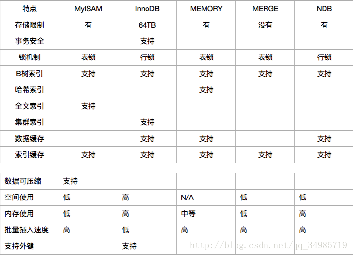

### 数据库事务

#### 什么是事务？

事务（Transaction）是并发控制的基本单位。所谓的事务，它是一个操作序列，这些操作要么都执行，要么都不执行，它是一个不可分割的工作单位。例如，银行转账工作：从一个账号扣款并使另一个账号增款，这两个操作要么都执行，要么都不执行,在关系数据库中,一个事务可以是一条SQL语句、一组SQL语句或整个程序。 。所以，应该把它们看成一个事务。事务是数据库维护数据一致性的单位，在每个事务结束时，都能保持数据一致性。

#### 事务的特性

事务具体四大特性，也就是经常说的ACID 
**1. 原子性（Atomicity） **
　　原子性是指事务包含的所有操作要么全部成功，要么全部失败回滚，因此事务的操作如果成功就必须要完全应用到数据库，如果操作失败则不能对数据库有任何影响。 

**2. 一致性（Consistency） **
一致性是指事务必须使数据库从一个一致性状态变换到另一个一致性状态，也就是说一个事务执行之前和执行之后都必须处于一致性状态。

拿转账来说，假设用户A和用户B两者的钱加起来一共是5000，那么不管A和B之间如何转账，转几次账，事务 结束后两个用户的钱相加起来应该还得是5000，这就是事务的一致性。
**3. 隔离性（Isolation）**

隔离性是当多个用户并发访问数据库时，比如操作同一张表时，数据库为每一个用户开启的事务，不能被其他事务的操作所干扰，多个并发事务之间要相互隔离。
    
即要达到这么一种效果：对于任意两个并发的事务T1和T2，在事务T1看来，T2要么在T1开始之前就已经结束，要么在T1结束之后才开始，这样每个事务都感觉不到有其他事务在并发地执行。

**4. 持久性（Durability） **     持久性是指一个事务一旦被提交了，那么对数据库中的数据的改变就是永久性的，即便是在数据库系统遇到故障的情况下也不会丢失提交事务的操作。Mysql中会保存有相应的操作日志，即使遭遇故障依然能够通过日志恢复最后一次更新。

　　例如我们在使用JDBC操作数据库时，在提交事务方法后，提示用户事务操作完成，当我们程序执行完成直到看到提示后，就可以认定事务以及正确提交，即使这时候数据库出现了问题，也必须要将我们的事务完全执行完成，否则就会造成我们看到提示事务处理完毕，但是数据库因为故障而没有执行事务的重大错误。

### mysql有哪些数据库引擎都有什么有特点

其实，我们在日常使用的数据库中，最为常见的数据库引擎大概有四种，分别是MyISAM，InnoDB,MEMORY，以及MERGE,这四种数据库存储引擎有着各自的特点和区别，今天就和大家简单分享一下这四种存储殷勤的区别。简要区别如下：
**MyISAM:**
有存储限制，表的定义语句，数据，索引分文件存储，分别为.frm文件，.MYD（MyDate），.MYI文件（MyIndex），存储方式分静态表（默认），动态表，压缩表。静态表中表字段定长，存储速度快，容易缓存，出现故障容易恢复，但是空间浪费严重。动态表中表字段不定长，空间浪费小，但是崩溃不易恢复，频繁的删除和更新会产生大量的碎片，可以使用OPTIMIZE TABLE命令定期清理碎片。同时MyISAM存储殷勤不支持外键，也不支持事务处理，但是其优势为访问速度快，在使用中中，如果对事务完整性没有要求，或者数据库操作主要以Select或者Insert为主的应用基本上可以使用这种存储引擎，而且MyISAM存储殷勤在也是5.5版本之前MySQL默认的存储引擎。
**InnoDB:**
提供回滚，提交，崩溃恢复的事务安全，唯一支持外键，表中的自动增长列必须是索引，如果是组合索引，必须是组合索引的第一列，并且自动增长列支持手动插入，但是如果插入值为空或者0，则实际值为增长后的值。创建外键时，要求父表必须有对应的索引，子表在创建外键的时候，也会自动创建对应的索引。如果某个表被其他表创建了外键参照，那么该表的对应索引或者主键禁止被删除。但是在创建索引时，可以指定在对父表进行删除或者更新时，子表所对应的操作，这些操作包括以下几种：
RESTRICT,CASCADE,SET NULL,NO ACTION，其实RESTRICT和NO ACTION作用相同，是指在子表有关联记录的时候，父表不允许更新，CASCADE是指在父表执行更新或者删除操作时，更新或者删除子表对应的记录，SET NULL是指在父表执行删除或者更新操作时，子表相应字段设置为NULL。
InnoDB在存储方式上，分为共享表空间和使用多表空间存储。
**MEMORY:**
数据存储在内存中，每一个MEMORY表对应一个磁盘文件，格式为.frm。由于数据存储在内存中，所以这种索引在数据存储和数据查询方面速度最快，但是服务器停止，数据丢失。并且在索引方面默认使用HASH索引，
**MERGE:**

多个MyISAM表的集合，实际没有建立新表，而是将MyISAM集合到一起。在磁盘上保存有两个文件，一个.frm文件存储表的定义语句，另外一个是.MRG文件，包含了组合表的信息，包括MERGE表由哪些表组成，插入新的数据时的依据。如果想MERGE表中插入数据，其中MERGE表所包含的MyISAM表中都会对该数据进行存储，但是向其中一个MyISAM表插入数据时，只有当前被插入数据的MyISAM表会有相应的数据，当然MERGE表中也会有，但是另外的MyISAM表不会存储该数据。简单而言MERGE表就是多个MyISAM表的并集。 

