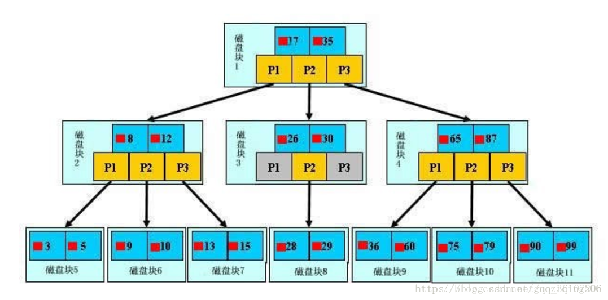
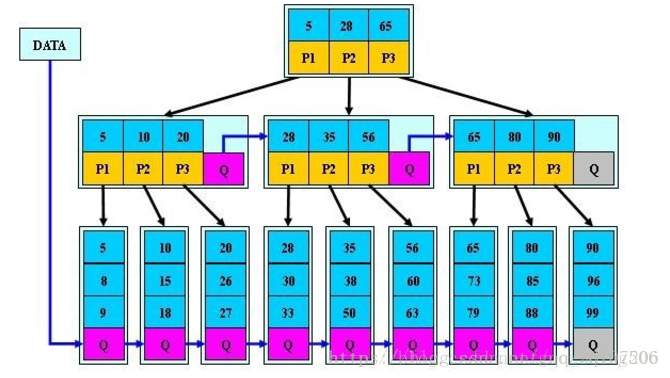

#### 过多索引的危害

1. 额外的索引要占用额外的磁盘空间
2. 降低写操作性能
3. 修改表内容时，索引必须更新，有时更需要重构，不必要的减缓表的修改速度
4. 生成一个执行计划考虑索引浪费时间
5. 索引过多选择不到最好的索引

#### mysql执行sql语句流程

客户端发送一条查询给服务器。

服务器先检查**查询缓存**，如果命中了缓存，则立刻返回存储在缓存中的结果。否则进入下一阶段。

服务器端**解析器**进行SQL解析、**预处理**，再由**优化器**生成对应的执行计划。

MySQL根据**优化器**生成的执行计划，再调用**存储引擎**的API来执行查询。

将结果返回给客户端。


 1、client和server建立连接，client发送sql至server（对应连接器这一过程） 

 2、server如果在查询缓存中发现了该sql，则直接使用查询缓存的结果返回给client，如果查询缓存中没有，则进入下面的步骤（对应查询缓存这一过程，8.0这一过程已经不存在了，8.0完全抛弃了这个功能） 

 3、server对sql进行语法分析，识别出sql里面的字符串是否符合标准，比如select关键字不能写错（对应分析器这一过程） 

 4、server对sql进行语义分析，识别出sql里面的字符串的具体意思是什么，比如T1是表名，C1是列名（对应分析器这一过程） 

 5、server确定sql的执行路径，比如走索引还是全表（对应优化器这一过程） 

 6、server对执行sql的用户进行权限检查，比如对表是否有权限执行(对应执行器这一过程) 

 7、server执行该sql语句，发送结果给client(对应执行器这一过程) 

 


 连接器-->查询缓存-->分析器-->优化器-->执行器 

#### 聚簇索引和非聚簇索引

**聚簇索引**：将数据存储与索引放到了一块，找到索引也就找到了数据

**非聚簇索引**：将数据存储于索引分开结构，索引结构的叶子节点指向了数据的对应行，myisam通过key_buffer把索引先缓存到内存中，当需要访问数据时（通过索引访问数据），在内存中直接搜索索引，然后通过索引找到磁盘相应数据，这也就是为什么索引不在key buffer命中时，速度慢的原因


 **聚簇索引**，就是指主索引文件和数据文件为同一份文件，聚簇索引主要用在Innodb存储引擎中。在该索引实现方式中B+Tree的叶子节点上的data就是数据本身，key为主键，如果是一般索引的话，data便会指向对应的主索引，如下图所示：

**非聚簇索引**就是指在B+Tree的每个叶子节点增加一个指向相邻叶子节点的指针，就形成了带有顺序访问指针的B+Tree。做这个优化的目的是为了提高区间访问的性能，例如图4中如果要查询key为从18到49的所有数据记录，当找到18后，只需顺着节点和指针顺序遍历就可以一次性访问到所有数据节点，极大提到了区间查询效率。  


#### MyisAM引擎与InnoDB引擎区别

1).［事务］MyISAM是非事务安全型的，而InnoDB是事务安全型的，默认开启自动提交，宜合并事务，一同提交，减小数据库多次提交导致的开销，大大提高性能。
2).［锁］MyISAM锁的粒度是表级，而InnoDB支持行级锁定。
3).［全文索引］MyISAM支持全文类型索引，而InnoDB不支持全文索引。
4).［查询效率］MyISAM相对简单，所以在效率上要优于InnoDB，小型应用可以考虑使用MyISAM。
5).［外健］MyISAM不支持外健，InnoDB支持。
6).［count］MyISAM保有表的总行数，InnoDB只能遍历。

两者都仅支持B＋树索引，不支持hash索引

应用场景：

1).MyISAM管理非事务表。它提供高速存储和检索，以及全文搜索能力。如果应用中需要执行大量的SELECT查询，那么MyISAM是更好的选择。
2).InnoDB用于事务处理应用程序，具有众多特性，包括ACID事务支持。如果应用中需要执行大量的INSERT或UPDATE操作，则应该使用InnoDB，这样可以提高多用户并发操作的性能。


#### 数据库有哪几种范式？             

**1 第一范式（1NF）**

 在任何一个关系数据库中，第一范式（1NF）是对关系模式的基本要求，不满足第一范式（1NF）的数据库就不是关系数据库。
 所谓第一范式（1NF）是指数据库表的每一列都是不可分割的基本数据项，同一列中不能有多个值，即实体中的某个属性不能有多个值或者不能有重复的属性。如果出现重复的属性，就可能需要定义一个新的实体，新的实体由重复的属性构成，新实体与原实体之间为一对多关系。在第一范式（1NF）中表的每一行只包含一个实例的信息。简而言之，**第一范式就是无重复的列。**  

**2 第二范式（2NF）**

 第二范式（2NF）是在第一范式（1NF）的基础上建立起来的，即满足第二范式（2NF）必须先满足第一范式（1NF）。第二范式（2NF）要求数据库表中的每个实例或行必须可以被惟一地区分。为实现区分通常需要为表加上一个列，以存储各个实例的惟一标识。这个惟一属性列被称为主关键字或主键、主码。
 第二范式（2NF）要求实体的属性完全依赖于主关键字。所谓完全依赖是指不能存在仅依赖主关键字一部分的属性，如果存在，那么这个属性和主关键字的这一部分应该分离出来形成一个新的实体，新实体与原实体之间是一对多的关系。为实现区分通常需要为表加上一个列，以存储各个实例的惟一标识。简而言之，**第二范式就是非主属性非部分依赖于主关键字。**  

**3 第三范式（3NF）**

 满足第三范式（3NF）必须先满足第二范式（2NF）。简而言之，第三范式（3NF）要求一个数据库表中不包含已在其它表中已包含的非主关键字信息。例如，存在一个部门信息表，其中每个部门有部门编号（dept_id）、部门名称、部门简介等信息。那么在员工信息表中列出部门编号后就不能再将部门名称、部门简介等与部门有关的信息再加入员工信息表中。如果不存在部门信息表，则根据第三范式（3NF）也应该构建它，否则就会有大量的数据冗余。简而言之，**第三范式就是属性不依赖于其它非主属性。** 

#### 数据库四大范式

1、第一范式：表的属性不可分
举例：一张用户表的电话字段可以被分为固定电话和手机两个字段，不符合第一范式。

2、第二范式：满足第一范式，非主键属性完全依赖于主键属性。
举例：一学生表，有学生姓名，学号，选修课程，课程教材，其中课程教材不是依赖学生，而是依赖选修的课程。

3、第三范式：满足第二范式，非主属性之间无传递依赖。

4、第四范式：主键属性之间无传递依赖


#### MySQL中varchar与char的区别以及varchar(50)中的50代表的涵义             

1、varchar与char的区别
 在单字节字符集下， char（ N） 在内部存储的时候总是定长， 而且没有变长字段长度列表中。 在多字节字符集下面， char(N)如果存储的字节数超过 N，那么 char（ N）将和 varchar（ N）没有区别。在多字节字符集下面，如果存 储的字节数少于 N，那么存储 N 个字节，后面补空格，补到 N 字节长度。 都存储变长的数据和变长字段长度列表。 varchar(N)无论是什么字节字符集，都是变长的，即都存储变长数据和变长字段长度列表。

 2、varchar(50)中50的涵义
 最多存放50个字符，varchar(50)和(200)存储hello所占空间一样，但后者在排序时会消耗更多内存，因为order  by col采用fixed_length计算col长度(memory引擎也一样)。在早期 MySQL 版本中， 50  代表字节数，现在代表字符数。

 3、int（20）中20的涵义
 是指显示字符的长度
 不影响内部存储，只是影响带 zerofill 定义的 int 时，前面补多少个 0，易于报表展示

 4、mysql为什么这么设计
 对大多数应用没有意义，只是规定一些工具用来显示字符的个数；int(1)和int(20)存储和计算均一样；


#### date,datetime和timestamp数据类型有什么区别


一个完整的日期格式如下：YYYY-MM-DD  HH:MM:SS[.fraction]，它可分为两部分：date部分和time部分，其中，date部分对应格式中的“YYYY-MM-DD”，time部分对应格式中的“HH:MM:SS[.fraction]”。对于date字段来说，它只支持date部分，如果插入了time部分的内容，它会丢弃掉该部分的内容，并提示一个warning。

 **timestamp和datetime的相同点：**

 （1） 两者都可用来表示YYYY-MM-DD HH:MM:SS[.fraction]类型的日期。

 **timestamp和datetime的不同点：**

 （1）两者的存储方式不一样

 对于TIMESTAMP，它把客户端插入的时间从当前时区转化为UTC（世界标准时间）进行存储。查询时，将其又转化为客户端当前时区进行返回。

 而对于DATETIME，不做任何改变，基本上是原样输入和输出。

 （2）两者所能存储的时间范围不一样

 timestamp所能存储的时间范围为：'1970-01-01 00:00:01.000000' 到 '2038-01-19 03:14:07.999999'。

 datetime所能存储的时间范围为：'1000-01-01 00:00:00.000000' 到 '9999-12-31 23:59:59.999999'。


#### union 与union all的区别             

union  在进行表链接后会筛选掉重复的记录，所以在表链接后会对所产生的结果集进行排 序运算，删除重复的记录再返回结果。 union all  则会显示重复结果,只是简单的两个结果合并并返回.所以效率比union高,在保证没有重复数据的情况下用union all.  

```
select name from table1unionselect name  from table2; 
```


#### drop,delete与truncate的区别             

drop直接删掉表 truncate删除表中数据，再插入时自增长id又从1开始 delete删除表中数据，可以加where字句。 

 	（1）  DELETE语句执行删除的过程是每次从表中删除一行，并且同时将该行的删除操作作为事务记录在日志中保存以便进行进行回滚操作。TRUNCATE  TABLE  则一次性地从表中删除所有的数据并不把单独的删除操作记录记入日志保存，删除行是不能恢复的。并且在删除的过程中不会激活与表有关的删除触发器。执行速度快。 

 	（2） 表和索引所占空间。当表被TRUNCATE 后，这个表和索引所占用的空间会恢复到初始大小，而DELETE操作不会减少表或索引所占用的空间。drop语句将表所占用的空间全释放掉。 

 	（3） 一般而言，drop > truncate > delete 

 	（4） 应用范围。TRUNCATE 只能对TABLE；DELETE可以是table和view 

 	（5） TRUNCATE 和DELETE只删除数据，而DROP则删除整个表（结构和数据）。 

 	（6） truncate与不带where的delete  ：只删除数据，而不删除表的结构（定义）drop语句将删除表的结构被依赖的约束（constrain),触发器（trigger)索引（index);依赖于该表的存储过程/函数将被保留，但其状态会变为：invalid。 

 	（7） delete语句为DML（data maintain Language),这个操作会被放到 rollback segment中,事务提交后才生效。如果有相应的 tigger,执行的时候将被触发。 

 	（8） truncate、drop是DLL（data define language),操作立即生效，原数据不放到 rollback segment中，不能回滚 

 	（9） 在没有备份情况下，谨慎使用 drop 与  truncate。要删除部分数据行采用delete且注意结合where来约束影响范围。回滚段要足够大。要删除表用drop;若想保留表而将表中数据删除，如果于事务无关，用truncate即可实现。如果和事务有关，或老师想触发trigger,还是用delete。 

 	（10） Truncate table 表名 速度快,而且效率高,因为:
 truncate table  在功能上与不带 WHERE 子句的 DELETE 语句相同：二者均删除表中的全部行。但 TRUNCATE TABLE 比 DELETE  速度快，且使用的系统和事务日志资源少。DELETE 语句每次删除一行，并在事务日志中为所删除的每行记录一项。TRUNCATE TABLE  通过释放存储表数据所用的数据页来删除数据，并且只在事务日志中记录页的释放。 

 	（11） TRUNCATE TABLE 删除表中的所有行，但表结构及其列、约束、索引等保持不变。新行标识所用的计数值重置为该列的种子。如果想保留标识计数值，请改用 DELETE。如果要删除表定义及其数据，请使用 DROP TABLE 语句。 

 	（12） 对于由 FOREIGN KEY 约束引用的表，不能使用 TRUNCATE TABLE，而应使用不带 WHERE 子句的 DELETE 语句。由于 TRUNCATE TABLE 不记录在日志中，所以它不能激活触发器。 


####  mysql有哪几种索引

**从数据结构角度 **	

1、B+树索引(O(log(n)))：关于B+树索引，可以参考 [MySQL索引背后的数据结构及算法原理](http://blog.codinglabs.org/articles/theory-of-mysql-index.html) 	

2、hash索引：
 a 仅仅能满足"=","IN"和"<=>"查询，不能使用范围查询
 b 其检索效率非常高，索引的检索可以一次定位，不像B-Tree 索引需要从根节点到枝节点，最后才能访问到页节点这样多次的IO访问，所以 Hash 索引的查询效率要远高于 B-Tree 索引
 c 只有Memory存储引擎显示支持hash索引 	

3、FULLTEXT索引（现在MyISAM和InnoDB引擎都支持了） 	

4、R-Tree索引（用于对GIS数据类型创建SPATIAL索引） 	

**从物理存储角度 	**

1、聚集索引（clustered index） 	

2、非聚集索引（non-clustered index） 	

**从逻辑角度 **	

1、主键索引：主键索引是一种特殊的唯一索引，不允许有空值 	

2、普通索引或者单列索引 	

3、多列索引（复合索引）：复合索引指多个字段上创建的索引，只有在查询条件中使用了创建索引时的第一个字段，索引才会被使用。使用复合索引时遵循最左前缀集合 	

4、唯一索引或者非唯一索引 	

5、空间索引：空间索引是对空间数据类型的字段建立的索引，MYSQL中的空间数据类型有4种，分别是GEOMETRY、POINT、LINESTRING、POLYGON。MYSQL使用SPATIAL关键字进行扩展，使得能够用于创建正规索引类型的语法创建空间索引。创建空间索引的列，必须将其声明为NOT  NULL，空间索引只能在存储引擎为MYISAM的表中创建 	

```
CREATE TABLE table_name[col_name data type]
[unique|fulltext|spatial][index|key][index_name](col_name[length])[asc|desc]
```

1、unique|fulltext|spatial为可选参数，分别表示唯一索引、全文索引和空间索引； 	

2、index和key为同义词，两者作用相同，用来指定创建索引 	

3、col_name为需要创建索引的字段列，该列必须从数据表中该定义的多个列中选择； 	

4、index_name指定索引的名称，为可选参数，如果不指定，MYSQL默认col_name为索引值； 	

5、length为可选参数，表示索引的长度，只有字符串类型的字段才能指定索引长度； 	

6、asc或desc指定升序或降序的索引值存储 	


#### innodb的事务与日志的实现方式             

1、有多少种日志

redo和undo

2、日志的存放形式

redo：在页修改的时候，先写到 redo log buffer 里面， 然后写到 redo log 的文件系统缓存里面(fwrite)，然后再同步到磁盘文件（ fsync）。
Undo：在 MySQL5.5 之前， undo 只能存放在 ibdata*文件里面， 5.6 之后，可以通过设置 innodb_undo_tablespaces 参数把 undo log 存放在 ibdata*之外。

3、事务是如何通过日志来实现的，说得越深入越好

基本流程如下：
因为事务在修改页时，要先记 undo，在记 undo 之前要记 undo 的 redo， 然后修改数据页，再记数据页修改的 redo。 Redo（里面包括 undo 的修改） 一定要比数据页先持久化到磁盘。 当事务需要回滚时，因为有 undo，可以把数据页回滚到前镜像的
状态，崩溃恢复时，如果 redo log 中事务没有对应的 commit 记录，那么需要用 undo把该事务的修改回滚到事务开始之前。 如果有 commit 记录，就用 redo 前滚到该事务完成时并提交掉。


#### 备份计划，mysqldump以及xtranbackup的实现原理             


```
(1)、备份计划

视库的大小来定，一般来说 100G 内的库，可以考虑使用 mysqldump 来做，因为 mysqldump更加轻巧灵活，备份时间选在业务低峰期，可以每天进行都进行全量备份(mysqldump 备份
出来的文件比较小，压缩之后更小)。100G 以上的库，可以考虑用 xtranbackup 来做，备份速度明显要比 mysqldump 要快。一般是选择一周一个全备，其余每天进行增量备份，备份时间为业务低峰期。

(2)、备份恢复时间

物理备份恢复快，逻辑备份恢复慢
这里跟机器，尤其是硬盘的速率有关系，以下列举几个仅供参考
20G的2分钟（mysqldump）
80G的30分钟(mysqldump)
111G的30分钟（mysqldump)
288G的3小时（xtra)
3T的4小时（xtra)
逻辑导入时间一般是备份时间的5倍以上

(3)、备份恢复失败如何处理

首先在恢复之前就应该做足准备工作，避免恢复的时候出错。比如说备份之后的有效性检查、权限检查、空间检查等。如果万一报错，再根据报错的提示来进行相应的调整。

(4)、mysqldump和xtrabackup实现原理

mysqldump

mysqldump 属于逻辑备份。加入--single-transaction 选项可以进行一致性备份。后台进程会先设置 session 的事务隔离级别为 RR(SET SESSION TRANSACTION ISOLATION LEVELREPEATABLE READ)，
之后显式开启一个事务(START TRANSACTION /*!40100 WITH CONSISTENTSNAPSHOT */)，这样就保证了该事务里读到的数据都是事务事务时候的快照。之后再把表的数据读取出来。 如果加上--master-data=1 的话，在刚开始的时候还会加一个数据库的读锁
(FLUSH TABLES WITH READ LOCK),等开启事务后，再记录下数据库此时 binlog 的位置(showmaster status)，马上解锁，再读取表的数据。等所有的数据都已经导完，就可以结束事务

Xtrabackup:

xtrabackup 属于物理备份，直接拷贝表空间文件，同时不断扫描产生的 redo 日志并保存下来。最后完成 innodb 的备份后，会做一个 flush engine logs 的操作(老版本在有 bug，在5.6 上不做此操作会丢数据)，确保所有的 redo log 都已经落盘(涉及到事务的两阶段提交
概念，因为 xtrabackup 并不拷贝 binlog，所以必须保证所有的 redo log 都落盘，否则可能会丢最后一组提交事务的数据)。这个时间点就是 innodb 完成备份的时间点，数据文件虽然不是一致性的，但是有这段时间的 redo 就可以让数据文件达到一致性(恢复的时候做的事
情)。然后还需要 flush tables with read lock，把 myisam 等其他引擎的表给备份出来，备份完后解锁。 这样就做到了完美的热备。
```


#### MySQL binlog的几种日志录入格式以及区别             

```
(1)、 各种日志格式的涵义

1.Statement：每一条会修改数据的sql都会记录在binlog中。
优点：不需要记录每一行的变化，减少了binlog日志量，节约了IO，提高性能。(相比row能节约多少性能 与日志量，这个取决于应用的SQL情况，正常同一条记录修改或者插入row格式所产生的日志量还小于Statement产生的日志量，
但是考虑到如果带条 件的update操作，以及整表删除，alter表等操作，ROW格式会产生大量日志，因此在考虑是否使用ROW格式日志时应该跟据应用的实际情况，其所 产生的日志量会增加多少，以及带来的IO性能问题。)
缺点：由于记录的只是执行语句，为了这些语句能在slave上正确运行，因此还必须记录每条语句在执行的时候的 一些相关信息，以保证所有语句能在slave得到和在master端执行时候相同 的结果。另外mysql 的复制,
像一些特定函数功能，slave可与master上要保持一致会有很多相关问题(如sleep()函数， last_insert_id()，以及user-defined functions(udf)会出现问题).
使用以下函数的语句也无法被复制：
* LOAD_FILE()
* UUID()
* USER()
* FOUND_ROWS()
* SYSDATE() (除非启动时启用了 --sysdate-is-now 选项)
同时在INSERT ...SELECT 会产生比 RBR 更多的行级锁

2.Row:不记录sql语句上下文相关信息，仅保存哪条记录被修改。
优点： binlog中可以不记录执行的sql语句的上下文相关的信息，仅需要记录那一条记录被修改成什么了。所以rowlevel的日志内容会非常清楚的记录下 每一行数据修改的细节。而且不会出现某些特定情况下的存储过程，或function，以及trigger的调用和触发无法被正确复制的问题
缺点:所有的执行的语句当记录到日志中的时候，都将以每行记录的修改来记录，这样可能会产生大量的日志内容,比 如一条update语句，修改多条记录，则binlog中每一条修改都会有记录，这样造成binlog日志量会很大，特别是当执行alter table之类的语句的时候，
由于表结构修改，每条记录都发生改变，那么该表每一条记录都会记录到日志中。

3.Mixedlevel: 是以上两种level的混合使用，一般的语句修改使用statment格式保存binlog，如一些函数，statement无法完成主从复制的操作，则 采用row格式保存binlog,MySQL会根据执行的每一条具体的sql语句来区分对待记录的日志形式，
也就是在Statement和Row之间选择 一种.新版本的MySQL中队row level模式也被做了优化，并不是所有的修改都会以row level来记录，像遇到表结构变更的时候就会以statement模式来记录。至于update或者delete等修改数据的语句，还是会记录所有行的变更。

(2)、适用场景

在一条 SQL 操作了多行数据时， statement 更节省空间， row 更占用空间。但是 row模式更可靠。

(3)、结合第一个问题，每一种日志格式在复制中的优劣

Statement 可能占用空间会相对小一些，传送到 slave 的时间可能也短，但是没有 row模式的可靠。 Row 模式在操作多行数据时更占用空间， 但是可靠。
```


#### MySQL的复制原理以及流程             


```
(1)、复制基本原理流程

1. 主：binlog线程——记录下所有改变了数据库数据的语句，放进master上的binlog中； 2. 从：io线程——在使用start slave 之后，负责从master上拉取 binlog 内容，放进 自己的relay log中； 3. 从：sql执行线程——执行relay log中的语句；

(2)、MySQL复制的线程有几个及之间的关联

MySQL 的复制是基于如下 3 个线程的交互（ 多线程复制里面应该是 4 类线程）：
1. Master 上面的 binlog dump 线程，该线程负责将 master 的 binlog event 传到slave；
2. Slave 上面的 IO 线程，该线程负责接收 Master 传过来的 binlog，并写入 relay log；
3. Slave 上面的 SQL 线程，该线程负责读取 relay log 并执行；
4. 如果是多线程复制，无论是 5.6 库级别的假多线程还是 MariaDB 或者 5.7 的真正的多线程复制， SQL 线程只做 coordinator，只负责把 relay log 中的 binlog读出来然后交给 worker 线程， woker 线程负责具体 binlog event 的执行；

(3)、MySQL如何保证复制过程中数据一致性及减少数据同步延时

一致性主要有以下几个方面：

1.在 MySQL5.5 以及之前， slave 的 SQL 线程执行的 relay log 的位置只能保存在文件（ relay-log.info）里面，并且该文件默认每执行 10000 次事务做一次同步到磁盘， 这意味着 slave 意外 crash 重启时， SQL 线程执行到的位置和数据库的数据是不一致的，将导致复制报错，如果不重搭复制，则有可能会
导致数据不一致。 MySQL 5.6 引入参数 relay_log_info_repository，将该参数设置为 TABLE 时， MySQL 将 SQL 线程执行到的位置存到mysql.slave_relay_log_info 表，这样更新该表的位置和 SQL 线程执行的用户事务绑定成一个事务，这样 slave 意外宕机后， slave 通过 innodb 的崩溃
恢复可以把 SQL 线程执行到的位置和用户事务恢复到一致性的状态。
2. MySQL 5.6 引入 GTID 复制，每个 GTID 对应的事务在每个实例上面最多执行一次， 这极大地提高了复制的数据一致性；
3. MySQL 5.5 引入半同步复制， 用户安装半同步复制插件并且开启参数后，设置超时时间，可保证在超时时间内如果 binlog 不传到 slave 上面，那么用户提交事务时不会返回，直到超时后切成异步复制，但是如果切成异步之前用户线程提交时在 master 上面等待的时候，事务已经提交，该事务对 master
上面的其他 session 是可见的，如果这时 master 宕机，那么到 slave 上面该事务又不可见了，该问题直到 5.7 才解决；
4. MySQL 5.7 引入无损半同步复制，引入参 rpl_semi_sync_master_wait_point，该参数默认为 after_sync，指的是在切成半同步之前，事务不提交，而是接收到 slave 的 ACK 确认之后才提交该事务，从此，复制真正可以做到无损的了。
5.可以再说一下 5.7 的无损复制情况下， master 意外宕机，重启后发现有 binlog没传到 slave 上面，这部分 binlog 怎么办？？？分 2 种情况讨论， 1 宕机时已经切成异步了， 2 是宕机时还没切成异步？？？ 这个怎么判断宕机时有没有切成异步呢？？？ 分别怎么处理？？？

延时性：

 5.5 是单线程复制， 5.6 是多库复制（对于单库或者单表的并发操作是没用的）， 5.7 是真正意义的多线程复制，它的原理是基于 group commit， 只要
master 上面的事务是 group commit 的，那 slave 上面也可以通过多个 worker线程去并发执行。 和 MairaDB10.0.0.5 引入多线程复制的原理基本一样。

(4)、工作遇到的复制 bug 的解决方法

5.6 的多库复制有时候自己会停止，我们写了一个脚本重新 start slave;待补充…
```


####  sql执行慢的原因有哪些，如何进行sql优化？             

**一、导致SQL执行慢的原因**

 1、硬件问题。如网络速度慢，内存不足，I/O吞吐量小，磁盘空间满了等。

 2、没有索引或者索引失效。（一般在互联网公司，DBA会在半夜把表锁了，重新建立一遍索引，因为当你删除某个数据的时候，索引的树结构就不完整了。所以互联网公司的数据做的是假删除，一是为了做数据分析,二是为了不破坏索引 ）

 3、数据过多（分库分表）

 4、服务器调优及各个参数设置（调整my.cnf）

 **二、分析原因时，一定要找切入点**

 1、先观察，开启慢查询日志，设置相应的阈值（比如超过3秒就是慢SQL），在生产环境跑上个一天过后，看看哪些SQL比较慢。

 2、Explain和慢SQL分析。比如SQL语句写的烂，索引没有或失效，关联查询太多（有时候是设计缺陷或者不得以的需求）等等。

 3、Show Profile是比Explain更近一步的执行细节，可以查询到执行每一个SQL都干了什么事，这些事分别花了多少秒。

 4、找DBA或者运维对MySQL进行服务器的参数调优。
             

解析：

(1)、explain出来的各种item的意义

id:每个被独立执行的操作的标志，表示对象被操作的顺序。一般来说， id 值大，先被执行；如果 id 值相同，则顺序从上到下。
select_type：查询中每个 select 子句的类型。
table:名字，被操作的对象名称，通常的表名(或者别名)，但是也有其他格式。
partitions:匹配的分区信息。
type:join 类型。
possible_keys：列出可能会用到的索引。
key:实际用到的索引。
key_len:用到的索引键的平均长度，单位为字节。
ref:表示本行被操作的对象的参照对象，可能是一个常量用 const 表示，也可能是其他表的
key 指向的对象，比如说驱动表的连接列。
rows:估计每次需要扫描的行数。
filtered:rows*filtered/100 表示该步骤最后得到的行数(估计值)。
extra:重要的补充信息。

(2)、profile的意义以及使用场景

Profile 用来分析 sql 性能的消耗分布情况。当用 explain 无法解决慢 SQL 的时候，需要用profile 来对 sql 进行更细致的分析，找出 sql 所花的时间大部分消耗在哪个部分，确认 sql的性能瓶颈。

(3)、explain 中的索引问题

Explain 结果中，一般来说，要看到尽量用 index(type 为 const、 ref 等， key 列有值)，避免使用全表扫描(type 显式为 ALL)。比如说有 where 条件且选择性不错的列，需要建立索引。
被驱动表的连接列，也需要建立索引。被驱动表的连接列也可能会跟 where 条件列一起建立联合索引。当有排序或者 group by 的需求时，也可以考虑建立索引来达到直接排序和汇总的需求。


#### 视图的作用，视图可以更改么？             

视图是虚拟的表，与包含数据的表不一样，视图只包含使用时动态检索数据的查询；不包含任何列或数据。使用视图可以简化复杂的sql操作，隐藏具体的细节，保护数据；视图创建后，可以使用与表相同的方式利用它们。
 视图不能被索引，也不能有关联的触发器或默认值，如果视图本身内有order by 则对视图再次order by将被覆盖。
 创建视图：create view XXX as XXXXXXXXXXXXXX;
 对于某些视图比如未使用联结子查询分组聚集函数Distinct Union等，是可以对其更新的，对视图的更新将对基表进行更新；但是视图主要用于简化检索，保护数据，并不用于更新，而且大部分视图都不可以更新。 


#### 存储过程与触发器的区别             


触发器与存储过程非常相似，触发器也是SQL语句集，两者唯一的区别是触发器不能用EXECUTE语句调用，而是在用户执行Transact-SQL语句时自动触发（激活）执行。触发器是在一个修改了指定表中的数据时执行的存储过程。通常通过创建触发器来强制实现不同表中的逻辑相关数据的引用完整性和一致性。由于用户不能绕过触发器，所以可以用它来强制实施复杂的业务规则，以确保数据的完整性。触发器不同于存储过程，触发器主要是通过事件执行触发而被执行的，而存储过程可以通过存储过程名称名字而直接调用。当对某一表进行诸如UPDATE、INSERT、DELETE这些操作时，SQLSERVER就会自动执行触发器所定义的SQL语句，从而确保对数据的处理必须符合这些SQL语句所定义的规则。


#### 如何在最快时间之内重启500台db             

可以使用批量 ssh 工具 pssh 来对需要重启的机器执行重启命令。 也可以使用 salt（前提是客户端有安装 salt）或者 ansible（ ansible 只需要 ssh 免登通了就行）等多线程工具同时操作多台服务器


#### 数据库的好处

1）可以持久化数据到本地 
 2）结构化查询


#### 数据库存储数据的特点

1）数据存在表中，然后表再放在库中 
 2）一个库中可以有多个表，每张表具有唯一的表名来标识自己 
 3）表中有一个或多个列，列又称为“字段”，相当于java中的“属性” 
 4）表中每一行数据，相当于java中的“对象”


#### 共享锁 VS 排他锁

1）共享锁又称读锁，若事务1对数据对象A加了共享锁，事务1可以读A但是不能修改A，其他事务只能再对他共享锁，不能加排他锁。这保证了其他事务可以读A，但是在事务1释放共享锁之前不能对A做任何操作。

2）排他锁又称写锁，若事务1对数据对象A加排他锁，事务1可以读A也可以修改A，其他事务不能对A加任何锁，直到事务1释放A上的锁。这保证其他事务在事务1释放排他锁之前不能读取和修改A。

非聚集索引和聚集索引的区别：

1）非聚集索引叶子节点并非数据节点。
2）叶子节点为每个真正的数据行存储一个“键-指针” 对
3）叶子节点还存储了一个指针偏移量，根据页指针及指针偏移可以定位到具体的数据行
4）在除叶节点外的其他索引节点，存储的是类似的内容，只不过指针指向的是下一级的索引。
6、索引的数据结构（B-树和B+树）

#### B-树和B+树

合这两幅图来讲：


B-树：
1）任意非叶子节点最多只有m个儿子。
1）每个非叶子节点都存放一个“键-指针对”，其中键是真正的数据，而指针指向的是下一级的节点。
2）非叶子节点的键的范围为 m/2-1<=K<=m-1。
2）如果非叶子节点的键为K，那么它的指针数P为K+1，儿子树=P。



B+树

B+树
1）基本定义与B-数相同。
2）若非叶子节点的键为K，那么它的指针数P为K，儿子树为K
3）所有的关键字都会在叶子节点出现，且按照叶子节点本身的依赖关键字大小顺序排序。

适合场景：B+树更适合文件索引和数据库索引。

#### 有索引就一定快吗？

不是的。

#### 应该在哪些列上加索引？（应用）

1）经常需要搜索的列，加快搜索速度
2）作为主键的列，强制该列的唯一性
3）经常用来连接的列，这些列主要是外键，可以加快连接速度
4）经常需要根据范围进行搜索的列，因为索引已经排序
5）经常需要排序的列


#### 何时索引会失效？

1）条件中有or，即时其中有条件带索引也不会使用（要想使用or 又想让索引生效，只能将 or 条件中每个列加上索引）。
2）like 查询，以%开头。
3）若列类型为字符串，则一定要在条件中将数据用引号引起来，否则不使用索引
4）若 Mysql 估计使用全表扫描要比索引快，则不使用索引

5）对索引进行运算导致索引列失效


#### 数据库模式：模式、内模式、外模式

模式：也称逻辑模式，是数据库中全体数据逻辑结构和特征的描述，是所有用户的公共数据视图

内模式：也称存储模式，它是数据物理结构和存储方式的描述，是数据在数据库内部的表示方式

外模式：也称子模式或者用户模式，是数据库用户能够看见和使用的局部数据的逻辑结构和特征的描述，是数据库用户的数据视图，是与某一应用有关的数据的逻辑的表示


#### Redis、Memecached 这两者有什么区别？

- Redis 支持更加丰富的数据存储类型，String、Hash、List、Set 和 Sorted Set。Memcached 仅支持简单的 key-value 结构。
- Memcached key-value存储比 Redis 采用 hash 结构来做 key-value 存储的内存利用率更高。
- Redis 提供了事务的功能，可以保证一系列命令的原子性
- Redis 支持数据的持久化，可以将内存中的数据保持在磁盘中
- Redis 只使用单核，而 Memcached 可以使用多核，所以平均每一个核上 Redis 在存储小数据时比 Memcached 性能更高。
